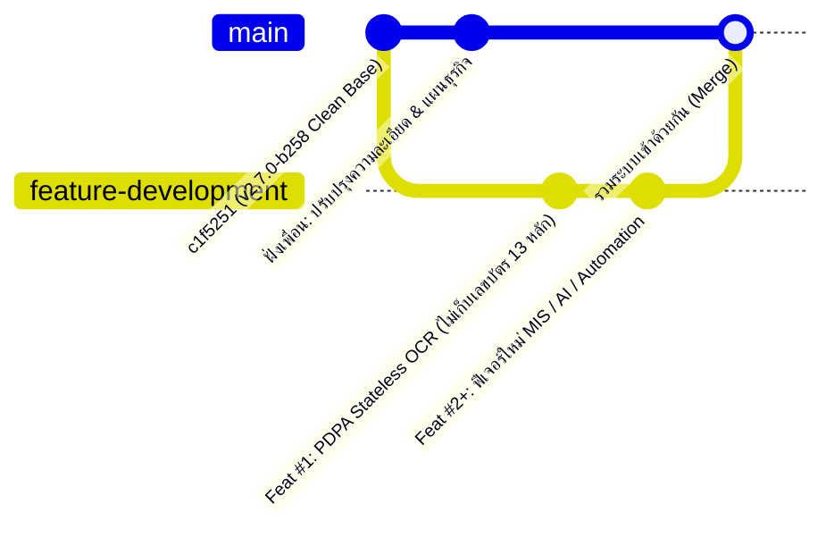

# 📘 บันทึกการพัฒนาฟีเจอร์ใหม่และคู่มือการรวมระบบ (Feature Development & Integration Log)

เอกสารนี้จัดทำขึ้นเพื่อบันทึกการแก้ไขโค้ด โครงสร้างฐานข้อมูล และรายการไฟล์ทั้งหมดในฝั่ง **การพัฒนาฟีเจอร์ใหม่ (`feature-development`)** เพื่อให้สามารถทำงานคู่ขนานกับฝั่ง **ปรับปรุงความละเอียดและแผนธุรกิจของเพื่อน (`main`)** และนำมารวมระบบ (Merge) กันย้อนหลังได้อย่างแม่นยำ ไม่เกิดโค้ดทับกัน

---

## 🔗 ลิงก์ตรวจสอบความต่างของโค้ดบน GitHub (Real-Time Diff & Pull Request)

สามารถกดลิงก์ด้านล่างเพื่อดูบรรทัดที่แก้ไขทั้งหมดเทียบกับฝั่ง `main` ได้ตลอดเวลา:
- 🔍 **ดูความต่างของโค้ดทั้งหมด (Compare View):**  
  [https://github.com/kritsakornporsche/kesorn2/compare/main...feature-development](https://github.com/kritsakornporsche/kesorn2/compare/main...feature-development)
- 🌿 **ดูประวัติ Commit ของฝั่งฟีเจอร์ใหม่ (`feature-development`):**  
  [https://github.com/kritsakornporsche/kesorn2/commits/feature-development](https://github.com/kritsakornporsche/kesorn2/commits/feature-development)

---

## 🧭 โครงสร้างการแบ่งงานพัฒนา 2 ส่วน (2-Track Parallel Development)



| ฝั่งการพัฒนา | Branch หลัก | ขอบเขตงานรับผิดชอบ |
| :--- | :--- | :--- |
| **1. ฝั่งเพื่อน (Business & Granularity)** | `main` (หรือ Branch ของเพื่อน) | ปรับปรุงความละเอียดของระบบเดิม, กฎเกณฑ์ทางธุรกิจ (Business Model), รายละเอียดการคิดเงิน/ค่าปรับ/บิล/สถานะห้องพัก |
| **2. ฝั่งเรา (New High-Tech Features & MIS)** | `feature-development` | พัฒนาฟีเจอร์ใหม่, ยกระดับ AI/Automation, กฎหมาย PDPA Privacy by Design, และระบบวิเคราะห์ข้อมูลผู้บริหาร (MIS) |

---

## 🛡️ กฎเหล็ก 4 ข้อในการเขียนโค้ดเพื่อป้องกันโค้ดชนกัน (Zero-Conflict Strategy)

1. **แยกไฟล์ใหม่เสมอ (Modular Isolation):**
   - เมื่อสร้างฟีเจอร์ใหม่ (เช่น MIS Dashboard, Credit Scoring, IoT Meter Simulator, Forecasting) ให้สร้างไฟล์แยกในโฟลเดอร์เฉพาะ เช่น:
     - `lib/features/...` หรือ `lib/mis/...`
     - `app/api/mis/...`
     - `components/features/...`
     - `app/owner/analytics/...`
   - **ข้อดี:** ไฟล์ที่สร้างใหม่จะไม่ชน (Conflict = 0%) กับไฟล์ที่เพื่อนกำลังแก้แน่นอน
2. **แตะไฟล์ส่วนกลางให้น้อยบรรทัดที่สุด (Plug-in Component Pattern):**
   - หากต้องนำฟีเจอร์ใหม่ไปแสดงในหน้าเดียวกับที่เพื่อนแก้ (เช่น หน้า `app/owner/page.tsx` หรือ `OwnerSidebar.tsx`) ให้สร้างเป็น Component แยกไฟล์ก่อน แล้วค่อยนำไป `import` วางในหน้าหลักเพียง 1–2 บรรทัด
3. **ห้ามลบหรือเปลี่ยนชื่อคอลัมน์ในฐานข้อมูล (Additive Database Schema Only):**
   - ห้ามใช้ `DROP COLUMN` หรือ `RENAME COLUMN` กับตารางเดิม (`users`, `tenants`, `rooms`, `contracts`, `bills`)
   - หากเลิกเก็บข้อมูลใด (เช่น `id_card_number`) ให้ส่งค่า `NULL` แทนการลบคอลัมน์ เพื่อให้ Query ฝั่งเพื่อนไม่พัง
   - หากฟีเจอร์ใหม่ต้องใช้ตาราง/คอลัมน์เพิ่ม ให้เขียนสคริปต์แบบ `CREATE TABLE IF NOT EXISTS` หรือ `ALTER TABLE ... ADD COLUMN IF NOT EXISTS` เสมอ
4. **จดบันทึกทุกฟีเจอร์ลงในเอกสารนี้ (`FEATURE_INTEGRATION_LOG.md`):**
   - ทุกครั้งที่ทำฟีเจอร์เสร็จ 1 ชิ้น จะมีการ Commit แยกเป็นรายฟีเจอร์ พร้อมระบุรายชื่อไฟล์ที่แตะต้องไว้ด้านล่างนี้

---

## 📦 บันทึกประวัติการพัฒนาฟีเจอร์ (Feature Registry)

### ✅ Feature #1: PDPA Privacy by Design — ยกเลิกการเก็บเลขบัตรประชาชน 13 หลักและรูปบัตร (Stateless AI ID Card OCR)
- **วันที่ดำเนินการ:** 10 ตุลาคม 2026
- **วัตถุประสงค์:** ปฏิบัติตามหลักการ Data Minimization ของ พ.ร.บ. คุ้มครองข้อมูลส่วนบุคคล (PDPA) โดยยังคงฟีเจอร์ AI อ่านบัตรประชาชนเพื่อดึงเฉพาะ **ชื่อ-นามสกุล** และ **ที่อยู่ตามทะเบียนบ้าน** มากรอกสัญญาเช่าอัตโนมัติ แต่ไม่ดึงและไม่บันทึกเลขบัตร 13 หลักหรือรูปบัตรลงฐานข้อมูล
- **ผลกระทบต่อฐานข้อมูล (Database Impact):**
  - ไม่มีการลบคอลัมน์ (`id_card_number` และ `id_card_image` ยังคงอยู่ในตาราง `tenants` และ `contracts` เพื่อไม่ให้โค้ดฝั่งเพื่อน Error)
  - บังคับบันทึกค่าเป็น `NULL` ทุกครั้งที่มีการสร้างหรืออัปเดตข้อมูล
  - คำสั่ง SQL สำหรับล้างข้อมูลเก่าเมื่อรวมระบบ:
    ```sql
    UPDATE tenants SET id_card_number = NULL, id_card_image = NULL WHERE id_card_number IS NOT NULL OR id_card_image IS NOT NULL;
    UPDATE contracts SET id_card_number = NULL, id_card_image = NULL WHERE id_card_number IS NOT NULL OR id_card_image IS NOT NULL;
    ```
- **รายการไฟล์ที่แก้ไข (Modified Shared Files - 11 ไฟล์):**

| ลำดับ | ไฟล์ที่แก้ไข | ลักษณะการแก้ไข (สำหรับการตรวจสอบตอน Merge) |
| :---: | :--- | :--- |
| 1 | `lib/id-card-ocr.ts` | ปรับ Prompt ของ `performIdCardOcr` ให้ดึงเฉพาะชื่อ-นามสกุลและที่อยู่ และคืนค่า `id_card_number: ''` เสมอ |
| 2 | `app/components/PdpaOcrConsentModal.tsx` | อัปเดตคำชี้แจง PDPA ว่าสกัดเฉพาะชื่อและที่อยู่แบบ Stateless ไม่เก็บเลข 13 หลักและรูปบัตร |
| 3 | `app/explore/room/[id]/page.tsx` | ลบช่องกรอกเลขบัตร 13 หลักใน Step 3 และปรับปุ่มถัดไปให้เช็คเฉพาะ `!bookingData.name \|\| !bookingData.id_card_address` |
| 4 | `app/components/WalkInTenantModal.tsx` | ลบช่องกรอกเลขบัตร 13 หลักในฟอร์มรับลูกหอ Walk-in |
| 5 | `app/owner/contracts/page.tsx` | เปลี่ยนคอลัมน์ในตารางเป็น `ที่อยู่ตามสัญญาเช่า`, ลบช่องเลขบัตร 13 หลักใน Modal สร้างสัญญา, อัปเดตฟังก์ชัน OCR |
| 6 | `app/owner/bookings/page.tsx` | เปลี่ยนการแสดงเลขบัตรในการ์ดจองและ Modal รายละเอียดสัญญาเป็นแสดงที่อยู่และอีเมลแทน |
| 7 | `app/api/contracts/route.ts` | เปลี่ยนค่า `id_card_number` และ `id_card_image` ในคำสั่ง `INSERT`/`UPDATE` ตาราง `tenants` และ `contracts` เป็น `NULL` |
| 8 | `app/api/owner/contracts/route.ts` | เปลี่ยนค่า `id_card_number` และ `id_card_image` ในคำสั่ง `INSERT`/`UPDATE` ตาราง `tenants` และ `contracts` เป็น `NULL` |
| 9 | `app/api/owner/tenants/walk-in/route.ts` | เปลี่ยนค่า `id_card_number` ในคำสั่ง `INSERT`/`UPDATE` ตาราง `tenants` และ `contracts` เป็น `NULL` |
| 10 | `app/api/contracts/export-docx/route.ts` | นำข้อความ `เลขประจำตัวประชาชน ...` ออกจากไฟล์ Word ให้ตรงกับฟอร์มสัญญา PDF ทางการ 3 หน้า |
| 11 | `components/DepositRefundModal.tsx` | นำ `request?.tenant_id_card` ออกจาก Fallback ของหมายเลข PromptPay คืนเงินมัดจำ |

---

## 🔄 คู่มือการรวมระบบย้อนหลัง (How to Merge Later)

เมื่อต้องการนำงานของเพื่อน (สมมติว่าอยู่บน `origin/main`) มารวมกับฟีเจอร์ใหม่ของเรา (`feature-development`) สามารถทำได้ 2 วิธี:

### วิธีที่ 1: ดึงงานของเพื่อนเข้ามาอัปเดตใน Branch ของเราก่อน (แนะนำให้ทำเป็นระยะ)
```bash
# 1. ดึงข้อมูลล่าสุดจาก GitHub
git fetch origin

# 2. สลับมาที่ Branch ฟีเจอร์ของเรา
git checkout feature-development

# 3. รวมโค้ดล่าสุดจากฝั่ง main ของเพื่อนเข้ามา
git merge origin/main
```

### วิธีที่ 2: ดูเฉพาะไฟล์ที่เราแก้ หรือยกฟีเจอร์เฉพาะชิ้นไปใส่โค้ดเพื่อน (Cherry-Pick)
หากเพื่อนแก้ไฟล์ไปเยอะมากและต้องการหยิบเฉพาะฟีเจอร์ของเราไปใส่ทีละชิ้นโดยไม่กระทบส่วนอื่น:
```bash
# ดูรายการ Commit เฉพาะฟีเจอร์ที่เราทำหลังจุดแยก Branch (v2.7.0-b258)
git log v2.7.0-b258..feature-development --oneline

# สลับไปที่ Branch ของเพื่อน แล้วดึงเฉพาะ Commit ฟีเจอร์ที่ต้องการไปวางทันที
git checkout main
git cherry-pick <commit-hash>
```
