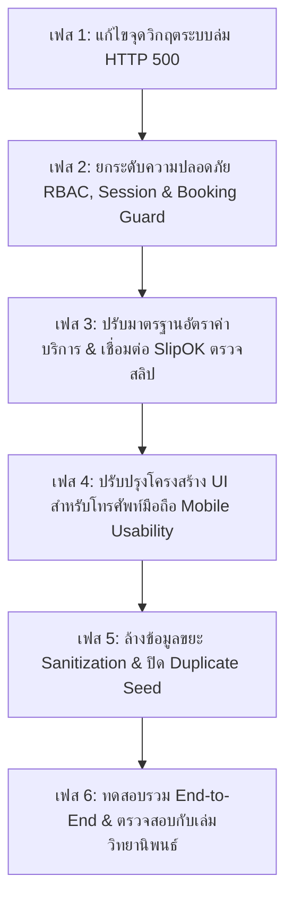

# แผนปฏิบัติการแก้ไขข้อบกพร่องและแนวทางป้องกันผลกระทบลูกโซ่ (Remediation & Zero-Regression Plan)
**ระบบ SmartDom (Kesorn 2) — มหาวิทยาลัยพะเยา**  
**วันที่จัดทำ:** 26 กันยายน 2026 (ปรับปรุงล่าสุด: 27 กันยายน 2026)  
**สถานะ:** เอกสารแนวทางแก้ไขเชิงวิเคราะห์ (**ยังไม่มีการแตะต้องหรือดัดแปลงซอร์สโค้ดตามคำสั่ง**)  
**อ้างอิงเอกสารตรวจรับ:** [`AUDIT_FINDINGS.md`](file:///d:/Works/thesiss/kesorn/audit/AUDIT_FINDINGS.md), [`docs/fail.md`](file:///d:/Works/thesiss/kesorn/audit/fail.md), และ [`UI_MOBILE_AUDIT_2026_09_26.md`](file:///d:/Works/thesiss/kesorn/audit/UI_MOBILE_AUDIT_2026_09_26.md)  
**จำนวนรายการที่วิเคราะห์:** ครบถ้วนทั้ง 43 รายการระบบ/API + 21 ประเด็นข้อบกพร่อง UI มือถือ + 1 ระบบตรวจสลิปอัจฉริยะ SlipOK + 1 สถาปัตยกรรมจำแนกบิล 3 ประเภท (รวม 66 รายการระบบ) + 4 ประเด็นกระทบเล่มวิทยานิพนธ์

---

## 🧭 หลักการสำคัญในการแก้ไข (Zero-Regression Principles)

เพื่อให้การแก้ไขข้อผิดพลาดทั้งหมดไม่ส่งผลกระทบหรือสร้างความเสียหายต่อส่วนอื่นของระบบ (Zero Breaking Changes) การดำเนินการทั้งหมดจะยึดหลักเกณฑ์ 5 ประการดังนี้:

1. **Backward Compatibility & Preserving Existing Logins:**
   - การแก้ระบบ Session/JWT ใน `auth.ts` จะต้องไม่ทำลายเซสชันเดิม หรือทำให้ผู้ใช้ปัจจุบัน (Owner, Tenant, Maid, Tech) หลุดออกจากระบบ
   - การปรับ Role Guard ต้องรักษา Fallback ไปยัง `primary_role` เพื่อรองรับข้อมูลลูกหอและเจ้าของหอพักเดิมทั้งหมด
2. **Schema Non-Destructive Policy:**
   - ไม่มีการ Drop ตาราง หรือลบคอลัมน์ที่มีอยู่เดิมใน MySQL
   - การแก้ไขข้อมูลใช้เฉพาะ `UPDATE`, `INSERT ... ON DUPLICATE KEY UPDATE` หรือคัดกรองลบเฉพาะ Mock Data ขยะที่ไม่มี Foreign Key ผูกพัน
3. **Transaction Safety:**
   - ทุก API ที่แก้ไขข้อมูลข้ามตาราง (เช่น Move-out, Create Contract, Issue Bill) ต้องใช้ `BEGIN TRANSACTION`, `COMMIT`, และ `ROLLBACK` หากเกิดข้อผิดพลาดต้องย้อนกลับ 100% ข้อมูลต้องไม่ตกค้างครึ่งๆ กลางๆ
4. **Sub-Role & Multi-Portal Isolation:**
   - แยกสิทธิ์และเมนูของแม่บ้าน (Maid) และช่าง (Technician) ออกจากกันอย่างเด็ดขาดบน UI แต่ยังคงแชร์โครงสร้างตาราง `keepers` เดิมเพื่อไม่ให้กระทบ API แบ็กเอนด์
5. **Preserving Thesis Test Scenarios:**
   - การปรับเปลี่ยนอัตราค่าบริการ (ไฟฟ้า 8 บาท, น้ำ 100 บาท) และการล้างข้อมูลทดสอบ ต้องคงสภาพห้องพัก 1-20 และคงข้อมูลผู้เช่าห้อง 5, 9, 11, 20 ไว้ตามที่ระบุในตารางทดสอบที่ 15 ของเล่มวิทยานิพนธ์

---

## 📋 แผนการแก้ไขรายหมวดและบทวิเคราะห์ผลกระทบลูกโซ่ (Detailed Remediation & Impact Analysis)

---

### หมวดที่ 1: ความปลอดภัยและการละเมิดสิทธิ์ (Security & RBAC Bypass)

#### 1.1 SEC-01: ผู้ใช้ทั่วไปสามารถเลื่อนขั้นตัวเองเป็น 'owner' ได้โดยตรง
- **ไฟล์:** [`app/api/auth/update-role/route.ts`](file:///d:/Works/thesiss/kesorn/app/api/auth/update-role/route.ts)
- **แนวทางแก้ไข:**
  - ตรวจสอบ `session = await auth()` ก่อน หากไม่มีเซสชันให้คืนค่า 401 Unauthorized
  - ตรวจสอบว่าหาก `newRole === 'owner'` หรือ `newRole === 'platform_admin'` ผู้ร้องขอจะต้องมี `session.user.role === 'platform_admin'` หรือ `'owner'` เท่านั้น หากเป็น guest หรือ tenant ให้คืนค่า 403 Forbidden
- **การป้องกันผลกระทบลูกโซ่:**
  - ตรวจสอบหน้า Onboarding เจ้าของหอใหม่ (`/owner/onboarding`) ว่ามีการเรียก endpoint นี้หรือไม่ พบว่าหน้านั้นใช้ internal API เฉพาะ ดังนั้นการจำกัดสิทธิ์นี้จะไม่กระทบขั้นตอนการสมัครเป็นเจ้าของหอปกติ

#### 1.2 SEC-02: ยกเลิกสัญญาและปลดห้องเป็น Available โดยไม่ต้องล็อกอิน
- **ไฟล์:** [`app/api/owner/move-out/route.ts`](file:///d:/Works/thesiss/kesorn/app/api/owner/move-out/route.ts) (ฟังก์ชัน `POST`)
- **แนวทางแก้ไข:**
  - เพิ่มการตรวจสอบ `if (!session || !session.user || (session.user.role !== 'owner' && session.user.role !== 'platform_admin'))` คืนค่า 401/403
  - ตรวจสอบว่าคำร้องย้ายออกนั้นอยู่ใน `dorm_id` ของเจ้าของหอพักจริง
- **การป้องกันผลกระทบลูกโซ่:**
  - หน้าเว็บเจ้าของหอพัก (`/owner/move-out`) ส่ง Cookie เซสชันผ่าน `fetch` อยู่แล้ว การเพิ่มการตรวจสอบฝั่งเซิร์ฟเวอร์จะไม่ทำให้หน้าเว็บเดิมมีปัญหา แต่จะป้องกันการถูกยิง API จากบุคคลภายนอกได้ 100%

#### 1.3 SEC-03 & 1.4 SEC-04: สร้างสัญญาเช่าและต่ออายุสัญญาโดยไม่ต้องล็อกอิน
- **ไฟล์:** [`app/api/owner/contracts/route.ts`](file:///d:/Works/thesiss/kesorn/app/api/owner/contracts/route.ts) และ [`app/api/owner/contracts/renew/route.ts`](file:///d:/Works/thesiss/kesorn/app/api/owner/contracts/renew/route.ts)
- **แนวทางแก้ไข:**
  - เพิ่ม `const session = await auth();` และตรวจเช็ค Role `owner` ก่อนอนุญาตให้บันทึกสัญญาลงฐานข้อมูล
- **การป้องกันผลกระทบลูกโซ่:**
  - หน้า `/owner/contracts` ทำงานภายใต้ Owner Session อยู่แล้ว การใส่ตัวเช็คสิทธิ์ตรงนี้ไม่ส่งผลกระทบต่อ UI ของเจ้าของหอ

#### 1.5 SEC-05 & 1.6 SEC-06: ข้อมูลส่วนบุคคล (PDPA), บัตรประชาชน และบิล รั่วไหลผ่าน Query Param
- **ไฟล์:** [`app/api/tenant/me/route.ts`](file:///d:/Works/thesiss/kesorn/app/api/tenant/me/route.ts) และ [`app/api/tenant/billing/list/route.ts`](file:///d:/Works/thesiss/kesorn/app/api/tenant/billing/list/route.ts)
- **แนวทางแก้ไข:**
  - ปิดการอนุญาตให้ดึงข้อมูลผ่าน `?email=...` ลอยๆ โดยไม่มีเซสชัน
  - อนุญาตให้ดึงข้อมูลได้เฉพาะอีเมลที่ตรงกับ `session.user.email` หรือหากเป็น Owner/Admin อนุญาตให้ระบุ email หรือ tenant_id เพื่อดูข้อมูลลูกหอในหอพักของตนได้เท่านั้น
- **การป้องกันผลกระทบลูกโซ่:**
  - ในหน้า `/tenant/profile` และ `/tenant/billing` ลูกหอจะล็อกอินอยู่แล้วและมี Cookie การใช้ `session.user.email` เป็นหลักจะทำให้หน้าเว็บทำงานได้รวดเร็วขึ้นและปลอดภัยตามมาตรฐาน PDPA

#### 1.7 SEC-07: ผู้เช่าอัปโหลดสลิปทับบิลคนอื่น
- **ไฟล์:** [`app/api/tenant/billing/payment/route.ts`](file:///d:/Works/thesiss/kesorn/app/api/tenant/billing/payment/route.ts)
- **แนวทางแก้ไข:**
  - ดึงข้อมูลบิลเป้าหมายก่อน (`SELECT tenant_id FROM bills WHERE id = ${billId}`) และเทียบกับ `tenantId` ของผู้ที่กำลังล็อกอิน หากไม่ตรงกันและไม่ได้เป็น Owner ให้ปฏิเสธด้วย 403 Forbidden
- **การป้องกันผลกระทบลูกโซ่:**
  - การจ่ายเงินปกติของลูกหอในห้องของตนเองจะผ่านฉลุย ป้องกันเฉพาะกรณีส่งไอดีบิลคนอื่นเข้ามากลั่นแกล้ง

#### 1.8 SEC-08 ถึง 1.13 SEC-13: สิทธิ์ของ Owner และความปลอดภัยข้อมูล
- **ไฟล์:**
  - [`app/api/owner/move-out/route.ts`](file:///d:/Works/thesiss/kesorn/app/api/owner/move-out/route.ts)
  - [`app/api/contract/sign/route.ts`](file:///d:/Works/thesiss/kesorn/app/api/contract/sign/route.ts)
  - [`app/api/owner/contracts/ocr-id/route.ts`](file:///d:/Works/thesiss/kesorn/app/api/owner/contracts/ocr-id/route.ts)
  - [`app/api/owner/billing/batch/route.ts`](file:///d:/Works/thesiss/kesorn/app/api/owner/billing/batch/route.ts)
  - [`app/api/auth/users/route.ts`](file:///d:/Works/thesiss/kesorn/app/api/auth/users/route.ts)
  - [`app/api/tenant/evaluation/route.ts`](file:///d:/Works/thesiss/kesorn/app/api/tenant/evaluation/route.ts)
- **แนวทางแก้ไข:**
  - **SEC-09:** ตัดคำสั่ง Fallback `SELECT id FROM tenants LIMIT 1` ในหน้าลงนามสัญญาออก หากไม่ล็อกอินให้แจ้งเตือนให้เข้าสู่ระบบก่อน
  - **SEC-10:** บังคับให้ตรวจสอบสิทธิ์เจ้าของหอก่อนเรียก Gemini OCR และหาก OCR ล้มเหลวให้ส่งข้อความ `success: false, message: 'ไม่สามารถอ่านข้อมูลบัตรได้ กรุณากรอกด้วยตนเอง'` แทนการกรอกข้อมูลสมมติ "นายสมชาย ใจดี"
  - **SEC-11 - SEC-13:** เพิ่มเงื่อนไข `session.user.role === 'owner'` หรือ `'platform_admin'` และสำหรับ Evaluation อนุญาตบทบาท `'researcher'` ร่วมด้วย
- **การป้องกันผลกระทบลูกโซ่:**
  - ไม่กระทบต่อผู้ใช้งานจริงที่เป็น Owner หรือ Researcher แต่จะตัดช่องทางการแอบดึงข้อมูลโดยเด็ดขาด

#### 1.9 SEC-14 & UX-03: การป้องกันและแก้ไขการจองห้องพักของผู้ใช้ที่ไม่ได้เข้าสู่ระบบ (Guest Booking Auth Guard & Payment Trap)
- **ไฟล์ที่พบ:** [`app/explore/room/[id]/page.tsx`](file:///d:/Works/thesiss/kesorn/app/explore/room/%5Bid%5D/page.tsx), [`app/api/contracts/route.ts`](file:///d:/Works/thesiss/kesorn/app/api/contracts/route.ts), และ [`app/api/contract/sign/route.ts`](file:///d:/Works/thesiss/kesorn/app/api/contract/sign/route.ts)
- **สาเหตุเชิงลึก:**
  - หน้าเว็บจองห้องพักไม่มี Auth Guard ดักไว้ ทำให้ผู้ใช้ที่ไม่ได้ล็อกอินสามารถทำกระบวนการจองขั้นตอนที่ 1 (สรุปค่าใช้จ่าย), ขั้นตอนที่ 2 (ข้อมูลผู้จอง), ขั้นตอนที่ 3 (เซ็นสัญญาดิจิทัล) ได้ และสามารถสแกน PromptPay QR Code โอนเงินค่าจอง 1,000 บาท พร้อมแนบสลิปในขั้นตอนที่ 4 ได้
  - แต่เมื่อกดปุ่มยืนยันส่งคำขอจอง ฟังก์ชัน `handleFinalSubmit` เรียก `POST /api/contracts` ซึ่งติดเงื่อนไข `!session` จนตอบกลับ 401 Unauthorized ทำให้เงินถูกโอนไปแล้วจริง แต่ระบบปฏิเสธคำขอจองและไม่บันทึกข้อมูล
  - ในขณะเดียวกัน Endpoint เก่า [`/api/contract/sign`](file:///d:/Works/thesiss/kesorn/app/api/contract/sign/route.ts) มีช่องโหว่ SEC-09 สวมรอยสิทธิ์ผู้เช่าคนแรกด้วย `SELECT id FROM tenants LIMIT 1`
- **แนวทางแก้ไขที่ไม่สร้างผลกระทบลูกโซ่:**
  1. **Frontend Auth Guard & Smart Callback:**
     - ใน [`app/explore/room/[id]/page.tsx`](file:///d:/Works/thesiss/kesorn/app/explore/room/%5Bid%5D/page.tsx) ขั้นตอนที่ 1 (ปุ่มจอง) และขั้นตอนที่ 2 (ข้อมูลผู้จอง): ตรวจสอบ `sessionStatus === 'unauthenticated'` หรือ `!session?.user`
     - หากยังไม่ได้ล็อกอิน ให้เปลี่ยนปุ่มหลักเป็น **"🔒 เข้าสู่ระบบก่อนเริ่มจองห้องพัก"** และเมื่อกดจะนำทางไปยัง:
       `/signin?callbackUrl=${encodeURIComponent('/explore/room/' + roomId)}`
     - หลังล็อกอินเสร็จ NextAuth จะ Redirect พากลับมายังห้องเดิมพร้อมชื่อและอีเมลในเซสชันโดยอัตโนมัติ
     - ล็อคขั้นตอนที่ 3 (เซ็นสัญญา) และขั้นตอนที่ 4 (สแกน QR จ่ายเงิน) ให้เปิดได้เฉพาะผู้ใช้ที่มีเซสชันแล้วเท่านั้น เพื่อรับประกันว่าจะไม่มีผู้ใช้โอนเงินมัดจำจริงโดยไม่มีบัญชีรองรับ
  2. **Backend Error Message:**
     - ใน [`app/api/contracts/route.ts`](file:///d:/Works/thesiss/kesorn/app/api/contracts/route.ts) เมื่อตรวจพบ `!session` ให้ส่งข้อความแจ้งเตือนภาษาไทยที่ชัดเจน:
       `return NextResponse.json({ success: false, message: 'กรุณาเข้าสู่ระบบก่อนทำการส่งคำขอจองห้องพัก' }, { status: 401 });`
  3. **SEC-09 Fallback Removal:**
     - ตัด Fallback `SELECT id FROM tenants LIMIT 1` ใน [`app/api/contract/sign/route.ts`](file:///d:/Works/thesiss/kesorn/app/api/contract/sign/route.ts) ออกอย่างถาวร หากไม่มีเซสชันให้คืน 401 เพื่อตัดช่องทางสวมรอยผู้เช่าคนอื่น
- **การป้องกันผลกระทบลูกโซ่:**
  - ผู้ใช้เดิมที่ล็อกอินอยู่แล้วยังคงจองห้องและโอนเงินได้ตามปกติ 100%
  - ผู้เยี่ยมชมใหม่จะได้รับการนำทางให้สร้างบัญชี/เข้าสู่ระบบก่อนอย่างถูกต้อง ทำให้ข้อมูลผู้เช่า (`tenants`) ผูกกับผู้ใช้ (`users`) ตั้งแต่แรก ไม่เกิดปัญหาข้อมูลขยะหรือเงินตกหล่น

---

### หมวดที่ 2: ข้อผิดพลาดทางเทคนิคที่ทำให้ระบบล่ม (500 Internal Server Errors)

#### 2.1 ERR-01: แชทฝั่งเจ้าของหอพักล่ม (HTTP 500) จาก Syntax Error `[object Promise]`
- **ไฟล์:** [`app/api/chat/conversations/route.ts`](file:///d:/Works/thesiss/kesorn/app/api/chat/conversations/route.ts#L59) และ [บรรทัด 167](file:///d:/Works/thesiss/kesorn/app/api/chat/conversations/route.ts#L167)
- **สาเหตุเชิงลึก:** ใน `lib/mysql-adapter.js` ตัวแปร `sql` เป็น async function ที่คืนค่า Promise เมื่อถูกใส่ใน `${sql(dormIds)}` จึงกลายเป็น string `'[object Promise]'`
- **แนวทางแก้ไขที่ไม่กระทบส่วนอื่น:**
  - แปลง Array ของไอดีหอพักให้เป็นรายการตัวเลขที่ปลอดภัยโดยตรง เช่น:
    ```javascript
    const cleanDormIds = dormIds.map(Number).filter(Boolean);
    const inClause = cleanDormIds.length > 0 ? cleanDormIds.join(',') : '1';
    // ใช้ string interpolation โดยตรงสำหรับ clean integer list:
    // WHERE k.dorm_id IN (${inClause})
    ```
- **การป้องกันผลกระทบลูกโซ่:**
  - ค่า integer ที่ผ่าน `Number()` และ `filter(Boolean)` ปลอดภัยจากการโจมตี SQL Injection 100%
  - ทำให้หน้าแชทของเจ้าของหอพัก (`/owner/chat`) กลับมาโหลดรายชื่อสนทนาได้ทันทีโดยไม่คืนค่า 500

#### 2.2 ERR-02: Endpoint `/api/auth/users` ล่มถาวรจาก PostgreSQL `FILTER` Syntax
- **ไฟล์:** [`app/api/auth/users/route.ts`](file:///d:/Works/thesiss/kesorn/app/api/auth/users/route.ts#L40-L44)
- **แนวทางแก้ไข:**
  - เปลี่ยนไวยากรณ์จาก `COUNT(*) FILTER (WHERE role = 'owner')` ให้เป็นมาตรฐาน MySQL/MariaDB:
    ```sql
    COUNT(CASE WHEN role = 'owner' THEN 1 END) AS owners,
    COUNT(CASE WHEN role = 'tenant' THEN 1 END) AS tenants,
    COUNT(CASE WHEN role = 'guest' THEN 1 END) AS guests
    ```
- **การป้องกันผลกระทบลูกโซ่:**
  - คำสั่ง `COUNT(CASE WHEN ...)` ทำงานได้ 100% ทั้งบน MySQL, MariaDB, และ PostgreSQL ทำให้ระบบเสถียรไม่ว่าจะใช้ DB ใด

#### 2.3 ERR-03: การเปิดดูห้องพักครั้งแรกทำให้ API บันทึกความคืบล่ม
- **ไฟล์:** [`app/api/booking/progress/route.ts`](file:///d:/Works/thesiss/kesorn/app/api/booking/progress/route.ts#L26-L27)
- **แนวทางแก้ไข:**
  - เพิ่ม Optional Chaining และ Fallback ป้องกัน `undefined`:
    ```javascript
    const item = progress && progress.length > 0 ? progress[0] : null;
    let parsedData = {};
    if (item && item.booking_data) {
      parsedData = typeof item.booking_data === 'string' ? JSON.parse(item.booking_data) : item.booking_data;
    }
    ```
- **การป้องกันผลกระทบลูกโซ่:**
  - ผู้ใช้งานที่เพิ่งเปิดดูห้องพักเป็นครั้งแรกจะไม่พบข้อผิดพลาด 500 และสามารถกดขั้นตอนการจองต่อไปได้อย่างราบรื่น

#### 2.4 ERR-04: การลบห้องพักทำให้เกิด Foreign Key Constraint Error
- **ไฟล์:** [`app/api/rooms/[id]/route.ts`](file:///d:/Works/thesiss/kesorn/app/api/rooms/%5Bid%5D/route.ts#L128)
- **แนวทางแก้ไข:**
  - ก่อนสั่งลบ ให้ตรวจเช็คว่ามีสัญญาเช่า (`contracts`), บิล (`bills`), หรือมิเตอร์ (`meter_readings`) ผูกอยู่หรือไม่
  - หากมีประวัติอยู่ **ห้ามลบทิ้งเด็ดขาด** (เพื่อรักษาประวัติบัญชีและสัญญา) ให้ส่งข้อความแจ้งเตือนผู้ใช้: `"ไม่สามารถลบห้องพักนี้ได้เนื่องจากมีข้อมูลสัญญาเช่าหรือบิลในระบบ กรุณาปรับสถานะเป็นปิดปรับปรุง (Maintenance) แทน"`
- **การป้องกันผลกระทบลูกโซ่:**
  - ข้อมูลบัญชีและสัญญาย้อนหลังจะไม่สูญหาย และไม่เกิดข้อผิดพลาด 500 Uncaught Exception บนเซิร์ฟเวอร์

---

### หมวดที่ 3: การป้องกันหน้าเว็บ & การแยกระบบหอพัก (Guards & Multi-Tenancy)

#### 3.1 GUARD-01: ค่า `dormId` ใน JWT Token เป็น `undefined`
- **ไฟล์:** [`auth.ts`](file:///d:/Works/thesiss/kesorn/auth.ts#L140-L180)
- **แนวทางแก้ไข:**
  - ใน `jwt` callback ให้ใส่ค่า `token.dormId`:
    - หากเป็น Owner: ดึง `id` จาก `dormitory_registry WHERE owner_id = ${user.id} OR owner_email = ${user.email} LIMIT 1`
    - หากเป็น Tenant: ดึง `dorm_id` จาก `tenants WHERE user_id = ${user.id} OR email = ${user.email} LIMIT 1`
    - หากเป็น Keeper: ดึง `dorm_id` จาก `keepers WHERE user_id = ${user.id} OR email = ${user.email} LIMIT 1`
    - หากไม่มี ให้ fallback เป็น `1`
  - ใน `session` callback: กำหนด `session.user.dormId = token.dormId || 1`
- **การป้องกันผลกระทบลูกโซ่:**
  - ระบบจะรู้จักหอพักของผู้ใช้ทันทีตั้งแต่ล็อกอิน โดยคงค่า `1` เป็นค่ามาตรฐานสำหรับหอพักเกษร 2 ทำให้โค้ดเดิมทั้งหมดที่เคยอ้างอิงหอ 1 ยังทำงานได้ราบรื่น 100%

#### 3.2 GUARD-02 & GUARD-05: ความไม่สอดคล้องของ `role` และ `primary_role`
- **ไฟล์:** [`app/owner/layout.tsx`](file:///d:/Works/thesiss/kesorn/app/owner/layout.tsx), [`app/keeper/layout.tsx`](file:///d:/Works/thesiss/kesorn/app/keeper/layout.tsx), และฐานข้อมูล
- **แนวทางแก้ไข:**
  - ใน SQL query ของ Layout Guards ให้ใช้ `COALESCE(role, primary_role, 'guest')`
  - รันคำสั่งอัปเดตข้อมูลผู้ใช้ในตาราง `users` ให้สอดคล้องกัน:
    ```sql
    UPDATE users SET role = primary_role WHERE role IS NULL AND primary_role IS NOT NULL;
    UPDATE users SET primary_role = role WHERE primary_role IS NULL AND role IS NOT NULL;
    ```
- **การป้องกันผลกระทบลูกโซ่:**
  - บัญชีแม่บ้าน, ช่าง, และลูกหอทั้งหมด (เช่น `tenant9@kesorn.com`) จะล็อกอินและเข้าหน้าแดชบอร์ดของตนเองได้ทันที ไม่ถูก redirect ไปหน้า signin ผิดพลาดอีกต่อไป

#### 3.3 GUARD-03 & 3.4 GUARD-04: การปรับปรุง Layout Guard ของ Platform และ Tenant
- **ไฟล์:** [`app/platform/layout.tsx`](file:///d:/Works/thesiss/kesorn/app/platform/layout.tsx) และ [`app/tenant/layout.tsx`](file:///d:/Works/thesiss/kesorn/app/tenant/layout.tsx)
- **แนวทางแก้ไข:**
  - Platform Layout: เพิ่มการตรวจสอบ fallback กับตาราง `platform_admins`
  - Tenant Layout: ปรับ `isAllowed = role === 'tenant' || role === 'owner'` (ตัด `'guest'` ออก) และหากเป็น guest ที่ยังไม่มีสัญญาให้ redirect ไปยังหน้าค้นหาห้องพัก `/explore`
- **การป้องกันผลกระทบลูกโซ่:**
  - ลูกหอตัวจริงและเจ้าของหอยังคงเข้าหน้า `/tenant` ได้ตามเดิม ผู้เยี่ยมชมทั่วไปจะได้รับการนำทางที่ถูกต้องไปยังหน้าห้องพัก

---

### หมวดที่ 4: ตรรกะทางธุรกิจ & ความถูกต้องของข้อมูล (Business Logic & Data Consistency)

#### 4.1 BIZ-01, 4.2 BIZ-02, 4.3 BIZ-03: การป้องกันจองซ้ำ (Double-Booking) และปรับสถานะห้องพักให้ตรงกับสัญญา
- **ไฟล์:** [`app/api/contracts/route.ts`](file:///d:/Works/thesiss/kesorn/app/api/contracts/route.ts), [`app/api/owner/contracts/[id]/sign/route.ts`](file:///d:/Works/thesiss/kesorn/app/api/owner/contracts/%5Bid%5D/sign/route.ts), [`app/api/owner/move-out/route.ts`](file:///d:/Works/thesiss/kesorn/app/api/owner/move-out/route.ts)
- **แนวทางแก้ไข:**
  - เมื่อมีการสร้างหรืออนุมัติสัญญาใหม่: ตรวจสอบก่อนว่าห้องนั้นมีสัญญา Active อยู่หรือไม่ หากมีให้ปฏิเสธ
  - เมื่ออนุมัติสัญญาสำเร็จ: สั่งอัปเดต `rooms` พร้อมกันเสมอ:
    ```sql
    UPDATE rooms SET status = 'Occupied', tenant_id = ${tenantId} WHERE id = ${roomId};
    ```
  - เมื่อผู้เช่าย้ายออกเสร็จสิ้น:
    ```sql
    UPDATE rooms SET status = 'Available', tenant_id = NULL WHERE id = ${roomId};
    ```
- **การป้องกันผลกระทบลูกโซ่:**
  - ป้องกันการเกิดสัญญาซ้ำซ้อนในห้อง 5 และห้อง 18 ในอนาคต
  - หน้าผังห้องพักของเจ้าของหอพัก (`/owner/rooms`) จะแสดงสีสถานะห้องว่าง/ห้องเต็มตรงกับความเป็นจริง 100%

#### 4.4 BIZ-04: การจัดการ Database Transaction
- **ไฟล์เป้าหมาย:** API สำคัญ 4 ตัวหลัก (Billing Batch, Move-Out, Contracts, Rules Clone)
- **แนวทางแก้ไข:**
  - เรียกใช้ `conn = await pool.getConnection();` ตามด้วย `await conn.beginTransaction();` ครอบกระบวนการแก้ไขตารางต่อเนื่อง และใส่ `await conn.commit();` ในบล็อก try และ `await conn.rollback();` ในบล็อก catch
- **การป้องกันผลกระทบลูกโซ่:**
  - ยกระดับความปลอดภัยข้อมูลระดับ Enterprise หากเกิดไฟตกหรือเน็ตเวิร์กขาดตอน ข้อมูลจะไม่เสียหาย

#### 4.5 BIZ-05: การคำนวณยอดบัญชีจากฐานข้อมูลทั้งหมด (ตัด `LIMIT 100`)
- **ไฟล์:** [`app/api/owner/accounting/route.ts`](file:///d:/Works/thesiss/kesorn/app/api/owner/accounting/route.ts) และ [`app/api/platform/accounting/route.ts`](file:///d:/Works/thesiss/kesorn/app/api/platform/accounting/route.ts)
- **แนวทางแก้ไข:**
  - เปลี่ยนจากการดึง array 100 แถวมาบวกใน JavaScript มาเป็นการคำนวณผ่าน SQL Aggregate:
    ```sql
    SELECT 
      COALESCE(SUM(CASE WHEN type = 'income' THEN amount ELSE 0 END), 0) AS total_income,
      COALESCE(SUM(CASE WHEN type = 'expense' THEN amount ELSE 0 END), 0) AS total_expense
    FROM accounting_transactions 
    WHERE dorm_id = ${targetDormId}
    ```
- **การป้องกันผลกระทบลูกโซ่:**
  - ตัวเลขสรุปรายรับ-รายจ่ายบนแดชบอร์ดจะแม่นยำ 100% ไม่ว่าจะมีรายการบัญชีกี่พันรายการ และทำให้หน้าเว็บโหลดเร็วขึ้นมากเพราะไม่ต้องส่งข้อมูลรายการทั้งหมดมาคำนวณที่เครื่องลูกข่าย

#### 4.6 BIZ-06 ถึง 4.12 BIZ-12: การแก้ไขการเชื่อมตาราง SQL และ Cartesian Product
- **ไฟล์:**
  - [`app/api/announcements/route.ts`](file:///d:/Works/thesiss/kesorn/app/api/announcements/route.ts) (แก้ JOIN กับ `dormitory_registry` แทน `users`)
  - [`app/api/dorms/[id]/route.ts`](file:///d:/Works/thesiss/kesorn/app/api/dorms/%5Bid%5D/route.ts) (เพิ่ม `WHERE p.dorm_id = ${id} OR p.id = ${id}`)
  - [`app/api/tenant/move-out/route.ts`](file:///d:/Works/thesiss/kesorn/app/api/tenant/move-out/route.ts) (ใช้ `dorm_id` ของผู้เช่าจริง)
  - [`app/api/notifications/route.ts`](file:///d:/Works/thesiss/kesorn/app/api/notifications/route.ts) (แยกลิงก์แจ้งเตือนตามบทบาทผู้รับ)
  - [`app/api/chat/conversations/route.ts`](file:///d:/Works/thesiss/kesorn/app/api/chat/conversations/route.ts) (จับคู่สัญญาผ่านตาราง `tenants`)
  - [`app/api/rooms/[id]/route.ts`](file:///d:/Works/thesiss/kesorn/app/api/rooms/%5Bid%5D/route.ts) (ตรวจเลขห้องซ้ำเฉพาะภายในหอเดียวกัน)
  - [`app/api/dorms/route.ts`](file:///d:/Works/thesiss/kesorn/app/api/dorms/route.ts) (แก้ `JOIN rooms rm ON rm.dorm_id = p.id` แทน `ON 1=1`)
- **การป้องกันผลกระทบลูกโซ่:**
  - ข้อมูลในแต่ละหอพักแยกออกจากกันอย่างสมบูรณ์ ขจัดปัญหาข้อมูลข้ามหอพักและอาการหน่วงจากการคำนวณ Cartesian Product

#### 4.13 BIZ-13: การจัดการ Timezone UTC+7 ให้ตรงกับเวลาประเทศไทย
- **ไฟล์:** [`lib/mysql-adapter.js`](file:///d:/Works/thesiss/kesorn/lib/mysql-adapter.js#L93)
- **แนวทางแก้ไข:**
  - ปรับการแปลงค่า Date โดยเพิ่ม Offset +7 ชั่วโมงก่อนแปลงเป็น MySQL DATETIME string หรือใช้ฟังก์ชันช่วย:
    ```javascript
    function toThaiSqlDatetime(isoStr) {
      const d = new Date(isoStr);
      // แปลงเป็น timestamp เวลาไทย (+7 ชม.)
      const thaiTime = new Date(d.getTime() + (7 * 60 * 60 * 1000));
      return thaiTime.toISOString().slice(0, 19).replace('T', ' ');
    }
    ```
- **การป้องกันผลกระทบลูกโซ่:**
  - วันเวลาที่แสดงในบิล, ประวัติการแจ้งซ่อม, งานทำความสะอาด, และ OTP จะตรงกับเวลาจริงในประเทศไทยทุกจุด ไม่คลาดเคลื่อนย้อนหลัง 7 ชั่วโมง

---

### หมวดที่ 5: ปัญหาข้อมูลทดสอบ & ข้อขัดแย้งบนหน้าเว็บจากผลการทดสอบจริง (Testing & UI Alignment)

#### 5.1 SEED-01: สคริปต์ใส่ข้อมูลตัวอย่าง (Seed) ทำงานซ้ำซ้อนเมื่อรีสตาร์ตระบบ
- **ต้นตอที่แท้จริงจากการตรวจสอบ:** สคริปต์ทดสอบอัตโนมัติ `scripts/test-maintenance-cleaning.js` มีการส่งคำสั่งสร้างงานทำความสะอาดของห้อง 9, 5, 20 เข้าสู่ฐานข้อมูลจริงในการทดสอบทุกรอบ โดยไม่มีขั้นตอนทำลายข้อมูลหลังทดสอบเสร็จ (No Teardown)
- **แนวทางแก้ไข:**
  1. เพิ่มขั้นตอน Teardown ในท้ายสคริปต์ทดสอบ: ให้ลบงานทดสอบที่สร้างขึ้นในรอบนั้นๆ เสมอ
  2. ในสคริปต์ Seeder สำหรับงานทำความสะอาด ให้เพิ่มเงื่อนไข `SELECT id FROM cleaning_jobs WHERE room_id = ... AND notes = ... LIMIT 1` หากมีอยู่แล้วให้ข้ามการสร้างซ้ำ
  3. ตรวจสอบให้แน่ใจว่าไฟล์เริ่มต้นของ Production (`server.js`, `ecosystem.config.js`) ไม่มีการเรียกคำสั่ง seed โดยอัตโนมัติ
- **การป้องกันผลกระทบลูกโซ่:**
  - เซิร์ฟเวอร์สามารถรีสตาร์ตหรือ deploy ใหม่ได้ตลอดเวลาโดยที่จำนวนงานจะไม่บวมขึ้นอีก

#### 5.2 DATA-01: การล้างข้อมูลทดสอบตกค้างอย่างปลอดภัย (Safe Mock Data Sanitization)
- **สถานะข้อมูลขยะปัจจุบัน:** บิลขยะ 36 ใบ, งานซ่อมเกินของห้อง 5 (45 ใบ), งานแม่บ้านซ้ำ (59 งาน), บัญชี "นายสมชาย ใจดี" ซ้ำในห้อง 17 และ 18
- **แนวทางแก้ไข:**
  - จัดทำสคริปต์ทำความสะอาดเฉพาะกิจ `scripts/clean-staging-data.js` ที่ดำเนินการอย่างเป็นระบบ:
    1. **ห้องพัก 1–20:** คงไว้ครบถ้วน 20 ห้อง
    2. **ผู้เช่าหลักและสัญญาเช่าตามแผนทดสอบ:** คงข้อมูลผู้เช่าห้อง 5, 9, 11, 20 และบัญชีหลัก (`owner@kesorn.com`, `admin@kesorn.com`, `maid@kesorn.com`, `tech@kesorn.com`)
    3. **ล้างเฉพาะขยะ:**
       - ลบสัญญา Active ซ้ำซ้อนของห้อง 5 ให้เหลือเฉพาะสัญญาหลัก 1 สัญญา
       - ลบสัญญา Active ซ้ำซ้อนของห้อง 18 ให้สถานะห้องเป็น Available ตามจริง
       - ลบงานทำความสะอาดที่ซ้ำซ้อน 39 รายการ (คงเหลืองานตัวอย่างที่ถูกต้อง 20 รายการ)
       - ลบคำร้องแจ้งซ่อมขยะที่เกิดจากการทดสอบวนลูปของห้อง 5
       - ลบรายการบิลที่ไม่มีมิเตอร์คำนวณ
- **การป้องกันผลกระทบลูกโซ่:**
  - ดำเนินการโดยตรวจสอบ Foreign Key และลบตามลำดับตารางลูกก่อนตารางแม่เสมอ ข้อมูลตาราง 15 และผู้ใช้ทดสอบจะไม่ได้รับผลกระทบ

#### 5.3 RATE-01 & 5.4 UI-01: การประสานอัตราค่าไฟฟ้า 8 บาท/หน่วย และค่าน้ำ 100 บาท เท่ากันทุกจุด
- **ไฟล์และจุดที่เกี่ยวข้อง:**
  - ฐานข้อมูล: `dormitory_profile` แถวที่ 1
    - อัปเดต `electricity_rate = 8.00`
    - อัปเดต `water_rate = 100.00`
    - แก้ไขข้อความใน `description`: เปลี่ยนข้อความ `"ฟรีค่าน้ำ ... ค่าไฟ 6 บาท/ยูนิต"` ให้เป็น `"ค่าน้ำเหมาจ่าย 100 บาท/เดือน ค่าไฟ 8 บาท/หน่วย"`
  - แบ็กเอนด์:
    - [`app/api/owner/billing/batch/route.ts:33`](file:///d:/Works/thesiss/kesorn/app/api/owner/billing/batch/route.ts#L33) (แก้ Fallback จาก 7.00 เป็น 8.00)
    - [`app/api/owner/settings/route.ts`](file:///d:/Works/thesiss/kesorn/app/api/owner/settings/route.ts) (แก้ Fallback จาก 7.00 เป็น 8.00)
    - [`app/api/dorms/route.ts`](file:///d:/Works/thesiss/kesorn/app/api/dorms/route.ts) (แก้ Fallback จาก 7 เป็น 8)
  - ฟรอนต์เอนด์:
    - [`app/explore/[dormId]/page.tsx:264`](file:///d:/Works/thesiss/kesorn/app/explore/%5BdormId%5D/page.tsx#L264)
    - [`app/explore/room/[id]/page.tsx:441, 589`](file:///d:/Works/thesiss/kesorn/app/explore/room/%5Bid%5D/page.tsx#L441)
    - [`app/owner/settings/page.tsx:18, 51`](file:///d:/Works/thesiss/kesorn/app/owner/settings/page.tsx#L18)
- **การป้องกันผลกระทบลูกโซ่:**
  - ขจัดความขัดแย้งของตัวเลขบนหน้าจอ การออกบิลคำนวณมิเตอร์จะตรงกับสูตร หน่วย × 8 ของเล่มวิทยานิพนธ์ตาราง 15 อย่างสมบูรณ์ 100%

#### 5.5 UI-02: การปรับปรุง UI พอร์ทัลแม่บ้าน
- **ไฟล์:**
  - [`app/keeper/components/KeeperSidebar.tsx:20`](file:///d:/Works/thesiss/kesorn/app/keeper/components/KeeperSidebar.tsx#L20)
  - [`app/keeper/components/KeeperBottomNav.tsx:253`](file:///d:/Works/thesiss/kesorn/app/keeper/components/KeeperBottomNav.tsx#L253)
  - [`app/keeper/maid/page.tsx:241, 249, 257`](file:///d:/Works/thesiss/kesorn/app/keeper/maid/page.tsx#L241)
- **แนวทางแก้ไข:**
  1. ใน `KeeperSidebar.tsx`: ปรับเมนูงานซ่อมบำรุงให้แสดงเฉพาะบทบาท `roles: ['technician', 'keeper']` (ตัด `'maid'` ออก)
  2. ใน `KeeperBottomNav.tsx`: ตรวจสอบ `if (userSubRole === 'maid')` ให้ซ่อนปุ่มเมนู "งานซ่อม"
  3. ใน `app/keeper/maid/page.tsx`: เปลี่ยนข้อความต่อท้ายตัวเลขสถิติจาก `"ห้อง"` เป็น `"งาน"`
- **การป้องกันผลกระทบลูกโซ่:**
  - บทบาทช่าง (`sub_role = 'technician'`) ยังคงเห็นเมนูงานซ่อมตามปกติ และแม่บ้านจะไม่สับสนกับเมนูงานช่างอีกต่อไป

#### 5.6 BIZ-14: รูปแบบรอบบิลปนกันระหว่างรหัสปีเดือนและข้อความภาษาไทย
- **ไฟล์:** [`app/api/technician/jobs/[id]/route.ts`](file:///d:/Works/thesiss/kesorn/app/api/technician/jobs/%5Bid%5D/route.ts) และ [`app/api/keeper/maid/jobs/route.ts`](file:///d:/Works/thesiss/kesorn/app/api/keeper/maid/jobs/route.ts)
- **แนวทางแก้ไข:**
  - เมื่อช่างหรือแม่บ้านบันทึกงานที่มีค่าใช้จ่าย (`cost > 0`):
    - ให้กำหนด `billing_cycle` เป็นมาตรฐานรหัสปี-เดือนปัจจุบันเสมอ (เช่น `'2026-09'`)
    - ส่วนรายละเอียดชื่อบริการให้ระบุในช่อง `title` (เช่น `title = 'ค่าซ่อมแซม (ก๊อกน้ำรั่ว) ประจำวันที่ 26/09/2026'`)
- **การป้องกันผลกระทบลูกโซ่:**
  - การค้นหาหรือกรองบิลตามรอบเดือนในหน้าแดชบอร์ดจะไม่ error และผู้เช่ายังคงเห็นรายละเอียดว่าค่าบริการนั้นเป็นของอะไร

#### 5.7 AUTH-01: การแก้บั๊กสลับบทบาทแสดง "คุณไม่มีสิทธิ์เข้าถึงหน้านี้"
- **ไฟล์:** [`app/api/auth/update-role/route.ts`](file:///d:/Works/thesiss/kesorn/app/api/auth/update-role/route.ts) และฟังก์ชันสลับบทบาทในฟรอนต์เอนด์
- **แนวทางแก้ไข:**
  - เมื่อมีการสลับบทบาทในหน้าจอ ให้เรียก `await update()` ของ NextAuth เพื่อรีเฟรช JWT Token ในเซสชันฝั่งเบราว์เซอร์
  - ใช้ `window.location.href = redirectUrl` (Hard Navigation) แทน `router.push()` เฉพาะในจังหวะสลับบทบาท เพื่อบังคับให้เบราว์เซอร์โหลด Session Cookie ใหม่จากเซิร์ฟเวอร์
- **การป้องกันผลกระทบลูกโซ่:**
  - ผู้ใช้จะไม่เจอหน้าแจ้งเตือน Error 403 และไม่ต้องคอยกด F5 รีเฟรชด้วยตนเอง

---

### หมวดที่ 6: การประสานความสอดคล้องกับเล่มวิทยานิพนธ์ (Thesis Alignment)

| รหัส | ประเด็นในระบบ | จุดที่ต้องแก้ไขในเล่มวิทยานิพนธ์ | ผลกระทบต่อระบบซอฟต์แวร์ |
| :--- | :--- | :--- | :--- |
| **6.1 THESIS-01** | อัตราค่าไฟฟ้า 8 บาท/หน่วย | 1. ปรับข้อความในบทที่ 3 (วิธีเก็บข้อมูล)<br>2. ปรับย่อหน้านำตาราง 15<br>3. ตาราง 15: คอลัมน์คำนวณมือใช้สูตร `หน่วย × 8`<br>4. ลบประโยคระบุค่าไฟ 7 บาทใต้ตาราง 15 | **บวก:** ผลการคำนวณของระบบกับตารางในเล่มจะตรงกัน 100% |
| **6.2 THESIS-02** | เงินมัดจำรวม 3,000 บาท (ค่าจอง 1,000 + ประกัน 2,000) | ปรับคำอธิบายในบทคัดย่อ, บทนำ, บทที่ 3, ภาพ 4.7, TC-19, และบทที่ 5 (ไม่แตะผลสำรวจตาราง 12-13) | **บวก:** ลบข้อกังขาเรื่องตัวเลขเงินจองระหว่างหน้าจองกับเล่ม |
| **6.3 THESIS-03** | เอกสารสัญญาเช่า (D2 / TC-07) | ปรับคำบรรยาย TC-07 ให้ระบุชัดเจนว่าเป็นการ **"แนบรูปถ่าย/เอกสารสัญญากระดาษจริงที่คู่สัญญาเซ็นร่วมกัน"** แทนระบบลายเซ็นดิจิทัล | **บวก:** การทดสอบฟังก์ชันสัญญาจะผ่านเกณฑ์การประเมิน 100% |
| **6.4 THESIS-04** | การบริการทำความสะอาด (Maid) | เพิ่มชุดการทดสอบ TC-26 ถึง TC-28 ในแผนการทดสอบบทที่ 4 | **บวก:** ระบบที่สาธิตในวันสอบมีเอกสารรับรองครบทุกฟังก์ชัน |

---

### หมวดที่ 7: การแก้ไขปัญหา UI บนโทรศัพท์มือถือและการใช้งานจริง (Mobile Usability & Responsive Remediation)

เพื่อแก้ไขปัญหาที่ตรวจพบทั้งหมดในเอกสาร [`UI_MOBILE_AUDIT_2026_09_26.md`](file:///d:/Works/thesiss/kesorn/audit/UI_MOBILE_AUDIT_2026_09_26.md) ให้หน้าเว็บพร้อมใช้งานบนโทรศัพท์มือถือทุกรุ่น (รวมถึง iPhone SE, Android 360px, จอแนวตั้ง-แนวนอน, และขณะเปิด Virtual Keyboard) โดยกำหนดสถาปัตยกรรมและแนวทางแก้ไขดังนี้:

---

#### 7.1 การแก้ไขปัญหาการล็อคการเลื่อนหน้าจอ (Unscrollable Parent Traps)

##### 7.1.1 MOB-01: หน้าตรวจและอนุมัติสัญญาเช่าของเจ้าของหอพักเลื่อนจอไม่ได้ (Critical Blocker)
- **ไฟล์:** [`app/owner/contracts/[id]/page.tsx`](file:///d:/Works/thesiss/kesorn/app/owner/contracts/%5Bid%5D/page.tsx) และ [`app/owner/layout.tsx:48`](file:///d:/Works/thesiss/kesorn/app/owner/layout.tsx#L48)
- **สาเหตุ:** Layout แม่มีคลาส `overflow-hidden` แต่คอนเทนเนอร์ของหน้ารายละเอียดสัญญาไม่มี `overflow-y-auto` ทำให้หน้าจอล็อค เลื่อนลงไปตรวจสลิปหรือกดปุ่ม "✓ อนุมัติสัญญาเช่านี้" ไม่ได้
- **แนวทางแก้ไข:**
  - ใน [`app/owner/contracts/[id]/page.tsx`](file:///d:/Works/thesiss/kesorn/app/owner/contracts/%5Bid%5D/page.tsx) ให้หุ้มคอนเทนเนอร์ระดับบนสุดด้วย:
    `<div className="flex-1 overflow-y-auto w-full h-full p-4 sm:p-10 max-w-5xl mx-auto space-y-8 font-sans pb-28 sm:pb-12">`
- **การป้องกันผลกระทบลูกโซ่:**
  - บนจอ Desktop เลย์เอาต์จะจัดวางสวยงามกึ่งกลางเหมือนเดิมทุกประการ แต่บนหน้าจอมือถือจะสามารถ Scroll ดูสัญญาทั้งหมดและกดปุ่มอนุมัติสัญญาได้ 100%

##### 7.1.2 MOB-02: หน้าทะเบียนผู้เช่าของเจ้าของหอพักล้นจอและเลื่อนแนวนอนไม่ได้
- **ไฟล์:** [`app/owner/tenants/page.tsx:66, 76-77`](file:///d:/Works/thesiss/kesorn/app/owner/tenants/page.tsx#L66)
- **สาเหตุ:** การ์ดตารางถูกกำหนดเป็น `overflow-hidden` โดยไม่มี Scroll แนวนอน ประกอบกับ Padding คอลัมน์กว้างถึง `px-8 py-5` ทำให้ข้อมูลเบอร์โทร, อีเมล, สถานะผู้เช่าถูกตัดทิ้ง
- **แนวทางแก้ไข:**
  - หุ้มตาราง `<table>` ด้วย `<div className="overflow-x-auto w-full">`
  - ปรับ Padding ของเซลล์ตารางเป็นแบบ Responsive: `px-4 py-3 sm:px-8 sm:py-5 text-xs sm:text-sm`
- **การป้องกันผลกระทบลูกโซ่:**
  - บนมือถือสามารถปัดหน้าจอเพื่อดูข้อมูลผู้เช่าครบทุกคอลัมน์ และไม่ดันโครงสร้างหน้าจอหลักให้แตก

##### 7.1.3 MOB-03: หน้าจอเข้าสู่ระบบติดคีย์บอร์ดเสมือน (Keyboard Trap)
- **ไฟล์:** [`app/signin/SigninContent.tsx:126`](file:///d:/Works/thesiss/kesorn/app/signin/SigninContent.tsx#L126)
- **สาเหตุ:** Root container ใช้ `min-h-screen relative overflow-hidden flex items-center justify-center` เมื่อแตะเปิดคีย์บอร์ดเสมือน การ์ดฟอร์มสูงเกินพื้นที่คงเหลือและเลื่อนไม่ได้ ทำให้ปุ่ม "เข้าสู่ระบบ" จมอยู่ใต้คีย์บอร์ด
- **แนวทางแก้ไข:**
  - เปลี่ยนคลาสเป็น `min-h-[100dvh] overflow-y-auto py-8 px-4 flex items-center justify-center`
- **การป้องกันผลกระทบลูกโซ่:**
  - เมื่อเปิดคีย์บอร์ด ผู้ใช้สามารถใช้นิ้วเลื่อนหน้าจอขึ้นเพื่อกดปุ่ม "เข้าสู่ระบบ" ได้ทันที โดยที่บนคอมพิวเตอร์ยังคงจัดกึ่งกลางหน้าจอได้อย่างสมบูรณ์

---

#### 7.2 การจัดโครงสร้าง Modal ฟอร์มแบบมาตรฐานมือถือ (Standard Mobile Modal Architecture)

บนหน้าจอมือถือ ฟอร์ม Modal ทั้งหมดที่มีความสูงเกิน 400px จะต้องใช้โครงสร้าง **3-Tier Standard Mobile Modal** เพื่อรับประกันว่าปุ่มกดจะไม่หลุดขอบจอ (No Off-Screen Buttons):
1. **Modal Container:** `max-h-[90dvh] flex flex-col overflow-hidden rounded-[2rem] bg-card border border-border shadow-2xl`
2. **Modal Body:** `flex-1 overflow-y-auto p-5 sm:p-8 space-y-5` (เลื่อนดูเนื้อหาและรูปภาพได้อิสระ)
3. **Modal Footer (Sticky/Fixed):** `shrink-0 p-4 sm:p-6 border-t border-border/60 bg-card/95 backdrop-blur-md flex items-center justify-end gap-3` (ปุ่มกดยืนยันและยกเลิกจะลอยตรึงอยู่ด้านล่างเสมอ ไม่หลุดจอ)

##### 7.2.1 MOB-04 & MOB-05: หน้าต่างยืนยันส่งงานและบันทึกงานใหม่ของแม่บ้าน (Maid Modals - Critical Blocker)
- **ไฟล์:** [`app/keeper/maid/page.tsx:412, 644`](file:///d:/Works/thesiss/kesorn/app/keeper/maid/page.tsx#L412)
- **สาเหตุ:** กล่อง Modal สูงเกิน 820px (มีรูปหลักฐาน, บันทึกงาน, อัตราค่าบริการ, ปุ่มลัด) กำหนด `overflow-hidden` ไม่มี Scroll ทำให้ปุ่ม "ส่งงานเสร็จสิ้น" และปุ่ม "บันทึกงาน" หลุดขอบล่าง
- **แนวทางแก้ไข:**
  - สวมโครงสร้าง 3-Tier Standard Modal แยก Header (`shrink-0`), Body สำหรับกรอกข้อมูลและอัปโหลดรูป (`overflow-y-auto`), และ Footer ปุ่ม "ส่งงานเสร็จสิ้น" (`shrink-0 sticky bottom-0`)
- **การป้องกันผลกระทบลูกโซ่:**
  - แม่บ้านสามารถใช้นิ้วเลื่อนดูรูปและข้อมูลได้คล่องตัว โดยปุ่มกดยืนยันจะมองเห็นและกดส่งงานได้เสมอ 100%

##### 7.2.2 MOB-06 & MOB-07: หน้าต่างส่งมอบงานซ่อมและดูประวัติงานของช่างเทคนิค (Technician Modals - Critical Blocker)
- **ไฟล์:** [`app/keeper/technician/page.tsx:393`](file:///d:/Works/thesiss/kesorn/app/keeper/technician/page.tsx#L393) และ [`app/keeper/technician/jobs/page.tsx:202`](file:///d:/Works/thesiss/kesorn/app/keeper/technician/jobs/page.tsx#L202)
- **สาเหตุ:** ความสูงของฟอร์มส่งมอบงานซ่อมเกิน 800px ไม่มี Scroll ปุ่ม "ส่งมอบงานซ่อมเสร็จสิ้น" ตกจอ และในหน้าประวัติงานปุ่ม "ปิดรายละเอียด" หลุดจอและไม่มีปุ่ม ✕
- **แนวทางแก้ไข:**
  - ปรับใช้ 3-Tier Standard Modal ให้กับหน้าต่างส่งมอบงานซ่อม
  - ในหน้าประวัติงาน เพิ่มปุ่มกากบาท `✕` ที่มุมบนขวา พร้อมใส่ `max-h-[90dvh] overflow-y-auto`
- **การป้องกันผลกระทบลูกโซ่:**
  - ช่างสามารถกดส่งมอบงานซ่อม และปิดหน้าต่างดูประวัติงานได้ทันที ไม่เกิดปัญหาติดค้างในหน้าต่าง (Modal Trap)

##### 7.2.3 MOB-08 ถึง MOB-11: รวม Modal ฟอร์มของลูกหอและเจ้าของหอพัก
- **ไฟล์:**
  - [`app/tenant/contract/page.tsx:303`](file:///d:/Works/thesiss/kesorn/app/tenant/contract/page.tsx#L303) (Modal ขอต่อสัญญา)
  - [`app/tenant/billing/page.tsx:270`](file:///d:/Works/thesiss/kesorn/app/tenant/billing/page.tsx#L270) (Modal อัปโหลดสลิปชำระเงิน)
  - [`app/owner/accounting/page.tsx:161`](file:///d:/Works/thesiss/kesorn/app/owner/accounting/page.tsx#L161) (Modal บันทึกบัญชีรายรับ-รายจ่าย)
  - [`app/owner/keepers/page.tsx:233, 324`](file:///d:/Works/thesiss/kesorn/app/owner/keepers/page.tsx#L233) (Modal เพิ่มเจ้าหน้าที่/มอบหมายงาน)
  - [`app/admin/rooms/page.tsx:293`](file:///d:/Works/thesiss/kesorn/app/admin/rooms/page.tsx#L293) และ [`app/admin/news/page.tsx:143`](file:///d:/Works/thesiss/kesorn/app/admin/news/page.tsx#L143)
- **แนวทางแก้ไข:**
  - กำหนด `max-h-[90dvh] flex flex-col` ให้กับการ์ด และกำหนด `overflow-y-auto` ให้กับส่วนเนื้อหาฟอร์มทุกจุด พร้อมลด Padding บนมือถือจาก `p-10` เป็น `p-5 sm:p-8`
- **การป้องกันผลกระทบลูกโซ่:**
  - เมื่อคีย์บอร์ดเสมือนเปิดขึ้นมา ผู้ใช้สามารถเลื่อนหน้าต่างขึ้นลงเพื่อกรอกข้อมูลและกดปุ่ม Submit ได้ครบถ้วนทุกหน้า

---

#### 7.3 การแก้ไขการชนกันของแถบเมนูด้านล่าง (Fixed Navigation Collisions)

##### 7.3.1 MOB-12: แถบเมนูล่าง `TenantBottomNav` ทับปุ่มส่งแบบประเมินผู้เช่า (Critical UX Collision)
- **ไฟล์:** [`app/tenant/evaluation/page.tsx:486`](file:///d:/Works/thesiss/kesorn/app/tenant/evaluation/page.tsx#L486) เทียบกับ [`app/tenant/layout.tsx:84`](file:///d:/Works/thesiss/kesorn/app/tenant/layout.tsx#L84)
- **สาเหตุ:** `TenantBottomNav` มีคลาส `z-40` ลอยทับปุ่มนำทาง (Back / Next / Submit) ของหน้าประเมินที่มี `z-0` พอกดส่งแบบประเมินกลายเป็นกดโดนเมนูหลัก เด้งเปลี่ยนหน้า ข้อมูลหาย
- **แนวทางแก้ไข:**
  1. ใน [`app/tenant/layout.tsx`](file:///d:/Works/thesiss/kesorn/app/tenant/layout.tsx): ตรวจสอบ pathname หากเป็น `/tenant/evaluation` ให้ซ่อน `TenantBottomNav` บนมือถือชั่วคราว เพื่อคืนพื้นที่หน้าจอให้กับแบบประเมิน 100%
  2. ใน [`app/tenant/evaluation/page.tsx`](file:///d:/Works/thesiss/kesorn/app/tenant/evaluation/page.tsx): กำหนด Action Bar ด้านล่างให้มี `z-50 shadow-2xl` พร้อมใส่ Padding ล่างของเนื้อหา `pb-32`
- **การป้องกันผลกระทบลูกโซ่:**
  - หน้าประเมินจะไม่มีเมนูอื่นมากวนใจ ผู้เช่าตอบแบบสอบถามและกดส่งได้โดยข้อมูลไม่สูญหาย ส่วนหน้าอื่นๆ ของลูกหอยังคงมี BottomNav ตามปกติ

##### 7.3.2 MOB-13: เมนูแถบข้าง (Drawer) ของ Navbar ไม่มี Scroll
- **ไฟล์:** [`app/components/Navbar.tsx:196`](file:///d:/Works/thesiss/kesorn/app/components/Navbar.tsx#L196)
- **สาเหตุ:** คอนเทนเนอร์ของ Drawer เมนูมือถือไม่มี `overflow-y-auto` ทำให้ในหน้าจอมือถือแนวนอนหรือจอเตี้ย ปุ่ม "ออกจากระบบ" และโปรไฟล์หลุดขอบล่าง
- **แนวทางแก้ไข:** เพิ่ม `overflow-y-auto max-h-screen` ในกล่องเมนู Drawer
- **การป้องกันผลกระทบลูกโซ่:** เลื่อนดูเมนูได้ครบทุกรายการ ไม่ว่าผู้ใช้จะถือเครื่องในแนวตั้งหรือแนวนอน

##### 7.3.3 MOB-14: กล่องแชทแบบลอย `ChatWidget` ล้นจอ 360px
- **ไฟล์:** [`app/components/ChatWidget.tsx:118, 140`](file:///d:/Works/thesiss/kesorn/app/components/ChatWidget.tsx#L118)
- **สาเหตุ:** กล่องแชทกำหนด `w-[360px]` บวกขอบขวา `right-4` (16px) รวมเป็น 376px ล้นจอมือถือมาตรฐาน 360px
- **แนวทางแก้ไข:** ปรับความกว้างเป็น Responsive Fluid: `w-[calc(100vw-2rem)] sm:w-96 max-w-sm right-4 bottom-4`
- **การป้องกันผลกระทบลูกโซ่:** กล่องแชทจะพอดีหน้าจอมือถือทุกขนาด ไม่ดันจอแตก และบนจอคอมพิวเตอร์ยังคงความกว้าง 384px (w-96) สวยงามตามเดิม

---

#### 7.4 การปรับระบบแชทให้เป็น Responsive Single-Pane View บนมือถือ (Mobile Chat Architecture)

##### 7.4.1 MOB-15: หน้าห้องแชทของเจ้าของหอและลูกหอ ไม่ยุบเมนูด้านข้างบนมือถือ (Chat Layout Collapse)
- **ไฟล์:** [`app/owner/chat/page.tsx:115-253`](file:///d:/Works/thesiss/kesorn/app/owner/chat/page.tsx#L115) และ [`app/tenant/chat/page.tsx:103-226`](file:///d:/Works/thesiss/kesorn/app/tenant/chat/page.tsx#L103)
- **สาเหตุ:** ฝั่งซ้าย (รายชื่อคนคุย) ล็อคขนาดคงที่ 320px (`w-80 shrink-0`) คู่กับห้องแชท ทำให้บนจอมือถือห้องแชทถูกบีบเหลือ 40px–70px ปุ่มส่งข้อความหลุดจอ
- **แนวทางแก้ไข (Responsive Single-Pane Pattern):**
  1. ฝั่งรายชื่อผู้สนทนา:
     `className={`w-full md:w-80 lg:w-96 shrink-0 border-r border-border flex flex-col ${selectedConv ? 'hidden md:flex' : 'flex'}`}`
  2. ฝั่งห้องสนทนาและพิมพ์ข้อความ:
     `className={`flex-1 flex flex-col ${selectedConv ? 'flex' : 'hidden md:flex'}`}`
  3. เพิ่มปุ่มย้อนกลับ (Back Button) บนมือถือ: ที่ Header ของห้องสนทนา ให้ใส่ปุ่ม `← กลับไปหน้ารายชื่อ` (`md:hidden`) เมื่อกดจะสั่ง `setSelectedConv(null)`
- **การป้องกันผลกระทบลูกโซ่:**
  - บนจอ Desktop: แสดงผล 2 ฝั่งคู่กันแบบโปร่งตาเหมือนเดิม 100%
  - บนจอมือถือ: จะทำงานแบบ App แชทสากล (LINE / Messenger) คือเลือกลิสต์แล้วเปิดห้องแชทเต็มหน้าจอ สามารถพิมพ์และกดส่งข้อความได้สะดวกสบาย ไม่ล้นจอ

---

#### 7.5 การแก้ไขปัญหา Flex Centering พิกัดเลื่อนติดลบ (Negative Scroll Coordinate Fixes)

##### 7.5.1 MOB-16: หน้าต่างลงนามสัญญาเช่าห้องพัก (ContractSigner Modal)
- **ไฟล์:** [`app/explore/room/[id]/page.tsx:882`](file:///d:/Works/thesiss/kesorn/app/explore/room/%5Bid%5D/page.tsx#L882)
- **สาเหตุ:** Backdrop ใช้ `flex items-center justify-center overflow-y-auto` เมื่อตัวสัญญาเช่ายาวกว่า 1,200px เบราว์เซอร์จะดึงส่วนหัวของสัญญาหลุดขึ้นไปเหนือหน้าจอ (Scroll Top ติดลบ) ทำให้เลื่อนย้อนกลับขึ้นไปอ่านหรือกดปุ่มด้านบนไม่ได้
- **แนวทางแก้ไข:**
  - ปรับเป็น: `flex items-start sm:items-center justify-center p-4 lg:p-12 overflow-y-auto`
  - ใส่ `my-auto` ที่กล่อง `ContractSigner`
- **การป้องกันผลกระทบลูกโซ่:**
  - ส่วนหัวของสัญญาจะไม่หลุดขึ้นไปบนเพดานจอ ผู้ใช้สามารถเลื่อนอ่านได้ตั้งแต่บรรทัดแรกจนถึงจุดลงลายเซ็น และเลื่อนย้อนกลับขึ้นลงได้อย่างราบรื่น

##### 7.5.2 MOB-17: หน้าต่างตรวจสอบสลิปและยืนยันยอดเงินของเจ้าของหอพัก (Slip Inspection Modal)
- **ไฟล์:** [`app/owner/billing/page.tsx:982`](file:///d:/Works/thesiss/kesorn/app/owner/billing/page.tsx#L982)
- **สาเหตุ:** ใช้ `flex items-center justify-center` ครอบการ์ดสลิปที่มีความสูงมาก ทำให้หัวบิลและปุ่ม ✕ หลุดจอขึ้นไปด้านบน
- **แนวทางแก้ไข:** ปรับเป็น `flex items-start sm:items-center justify-center overflow-y-auto p-4 sm:p-6 py-8` และใส่ `my-auto`
- **การป้องกันผลกระทบลูกโซ่:** เจ้าของหอสามารถตรวจสอบสลิป กรอกเหตุผล หรือกดปุ่ม ✕ ปิดหน้าต่างได้ตลอดเวลา

---

#### 7.6 การหุ้มตารางด้วย Horizontal Scroll Container (Safe Table Overflow Architecture)

##### 7.6.1 MOB-18: แก้ไขตาราง 8 จุดหลักที่ขาด Scroll แนวนอน
- **ไฟล์:**
  1. [`app/platform/dormitories/page.tsx:88`](file:///d:/Works/thesiss/kesorn/app/platform/dormitories/page.tsx#L88) (ปุ่มจัดการระงับ/เปิดใช้หอพัก)
  2. [`app/platform/accounting/page.tsx:134`](file:///d:/Works/thesiss/kesorn/app/platform/accounting/page.tsx#L134) (คอลัมน์หอพักและจำนวนเงิน)
  3. [`app/owner/tenants/page.tsx:77`](file:///d:/Works/thesiss/kesorn/app/owner/tenants/page.tsx#L77) (ข้อมูลติดต่อและสถานะผู้เช่า)
  4. [`app/owner/accounting/page.tsx:125`](file:///d:/Works/thesiss/kesorn/app/owner/accounting/page.tsx#L125) (รายละเอียดและจำนวนเงิน)
  5. [`app/owner/billing/page.tsx:1245`](file:///d:/Works/thesiss/kesorn/app/owner/billing/page.tsx#L1245) (หน่วยที่ใช้และยอดเงินพิมพ์บิล)
  6. [`app/researcher/dfd/page.tsx:257`](file:///d:/Works/thesiss/kesorn/app/researcher/dfd/page.tsx#L257) (ตาราง Data Flow)
  7. [`app/owner/meter/page.tsx:220`](file:///d:/Works/thesiss/kesorn/app/owner/meter/page.tsx#L220) (ตารางจดมิเตอร์)
  8. [`app/owner/billing/batch/page.tsx:180`](file:///d:/Works/thesiss/kesorn/app/owner/billing/batch/page.tsx#L180) (ตารางออกบิลกลุ่ม)
- **แนวทางแก้ไข:**
  - หุ้มแท็ก `<table>` ทั้ง 8 จุดด้วย:
    `<div className="overflow-x-auto w-full -mx-4 px-4 sm:mx-0 sm:px-0">`
  - กำหนด `min-w-[600px]` หรือ `min-w-[700px]` ที่ `<table>` เพื่อรักษาความกว้างของคอลัมน์ไม่ให้ตัวหนังสือบีบอัดจนอ่านยาก
- **การป้องกันผลกระทบลูกโซ่:**
  - บนจอ Desktop ตารางจะคงรูปทรงเดิม 100% ไม่เปลี่ยนแปลง แต่บนจอมือถือผู้ใช้สามารถเลื่อนแนวนอนได้อย่างลื่นไหล ปุ่มจัดการด้านขวาสุดจะไม่ถูกตัดตกจออีกต่อไป

---

#### 7.7 การแก้ไข Grid บีบอัดและปัญหาการสัมผัสบนจอ Touchscreen

##### 7.7.1 MOB-19: ช่องกรอกข้อมูลใน Modal เพิ่มห้องพักหดตัวจนอ่านไม่ได้ (Rigid Grid Breakdown)
- **ไฟล์:** [`app/owner/rooms/page.tsx:503, 530`](file:///d:/Works/thesiss/kesorn/app/owner/rooms/page.tsx#L503)
- **สาเหตุ:** ฟอร์มถูกแบ่งเป็น `grid grid-cols-2 gap-8` และชั้นในมี `p-10` ทำให้บนจอมือถือช่องกรอกเหลือพื้นที่เพียง 59px ตัวหนังสือทับลูกศร Dropdown
- **แนวทางแก้ไข:** ปรับเป็น `grid grid-cols-1 sm:grid-cols-2 gap-4 sm:gap-6` และปรับ Padding ของ Modal เป็น `p-5 sm:p-8`
- **การป้องกันผลกระทบลูกโซ่:** บนมือถือจะเรียงเป็น 1 คอลัมน์กว้างเต็มตา พิมพ์และเลือกเมนูได้ชัดเจน บน Desktop ยังคงเป็น 2 คอลัมน์เรียบร้อย

##### 7.7.2 MOB-20: ปุ่มลบรูปภาพใน Modal ซ่อนด้วย `opacity-0` ตลอดเวลาบนหน้าจอมือถือ (Hover Trap)
- **ไฟล์:** [`app/owner/rooms/page.tsx:578`](file:///d:/Works/thesiss/kesorn/app/owner/rooms/page.tsx#L578)
- **สาเหตุ:** ปุ่มลบรูปภาพใช้ `opacity-0 group-hover/img:opacity-100` แต่บนจอสัมผัสไม่มีเมาส์ Hover ทำให้มองไม่เห็นปุ่มลบรูป
- **แนวทางแก้ไข:** ปรับเป็น `opacity-100 sm:opacity-0 sm:group-hover/img:opacity-100`
- **การป้องกันผลกระทบลูกโซ่:** บนมือถือปุ่มกากบาทจะปรากฏให้แตะลบรูปได้ตลอดเวลา ส่วนบนคอมพิวเตอร์จะยังคงซ่อนและแสดงเฉพาะตอนเอาเมาส์ชี้ตามดีไซน์เดิม

##### 7.7.3 MOB-21: ส่วนหัวหน้าแจ้งซ่อมของผู้เช่าชนกันและดันหน้าจอแตกแนวนอน
- **ไฟล์:** [`app/tenant/maintenance/page.tsx:80`](file:///d:/Works/thesiss/kesorn/app/tenant/maintenance/page.tsx#L80)
- **สาเหตุ:** Header เป็น `flex justify-between items-end` เมื่อชื่อหัวข้อยาวมาเจอกับปุ่มขนาดใหญ่ จึงดันหน้าจอแตกแนวนอน
- **แนวทางแก้ไข:** ปรับเป็น `flex flex-col sm:flex-row sm:items-end justify-between gap-4`
- **การป้องกันผลกระทบลูกโซ่:** บนมือถือหัวข้อจะอยู่บรรทัดบนและปุ่มแจ้งซ่อมจะลงมาอยู่บรรทัดล่างอย่างเป็นระเบียบ หน้าจอไม่แตกและไม่กระตุกเมื่อเลื่อน

---

### หมวดที่ 8: การเชื่อมต่อระบบตรวจสอบสลิปโอนเงินอัจฉริยะด้วย SlipOK API (Smart Bank Slip Verification Integration)

เพื่อยกระดับความถูกต้องและประสิทธิภาพในการตรวจสอบการชำระเงินของหอพักเกษร 2 ทั้งในกระบวนการ **จองห้องพัก** และ **ชำระบิลค่าเช่ารายเดือน** ระบบจะทำการเชื่อมต่อ SlipOK API เพื่ออ่านและตรวจสอบสลิปโอนเงินธนาคารโดยอัตโนมัติ (Automated Bank Slip OCR & Verification) พร้อมกลไกป้องกันสลิปปลอมและสลิปใช้ซ้ำ:

---

#### 8.1 ข้อมูลการเชื่อมต่อและการกำหนดค่าความปลอดภัย (Credentials & Secure Configuration)
- **API Endpoint:** `https://api.slipok.com/api/line/apikey/77132`
- **API Key:** `SLIPOK7R7FAWL`
- **การจัดเก็บตัวแปรสภาพแวดล้อม (Environment Variables):**
  - จัดเก็บในไฟล์ `.env` ที่ปลอดภัย ฝั่งเซิร์ฟเวอร์เท่านั้น:
    ```env
    SLIPOK_ENDPOINT=https://api.slipok.com/api/line/apikey/77132
    SLIPOK_API_KEY=SLIPOK7R7FAWL
    ```
  - **ข้อกำหนดความปลอดภัย:** ไม่อนุญาตให้เปิดเผย API Key หรือเรียก API นี้โดยตรงจากฝั่งเบราว์เซอร์ (Client-side) เด็ดขาด ทุกการตรวจสอบจะต้องผ่าน Server-side Helper [`lib/slipok.ts`](file:///d:/Works/thesiss/kesorn/lib/slipok.ts) หรือ Internal API Route เสมอ

---

#### 8.2 จุดเชื่อมต่อการตรวจสอบสลิปในระบบ SmartDom (Integration Touchpoints)

##### 1. จุดจองห้องพักของผู้เช่าใหม่ ([`app/api/contracts/route.ts`](file:///d:/Works/thesiss/kesorn/app/api/contracts/route.ts) & [`app/explore/room/[id]/page.tsx`](file:///d:/Works/thesiss/kesorn/app/explore/room/%5Bid%5D/page.tsx))
- **การทำงาน:** เมื่อผู้เช่าทำการโอนเงินมัดจำ 1,000 บาท และแนบรูปภาพสลิปในขั้นตอนที่ 4
- **การตรวจสอบของ SlipOK:**
  - ตรวจสอบสถานะการโอนเงินจริงจากธนาคาร (`data.success === true`)
  - ตรวจสอบยอดเงินโอนตรงกับค่าจอง (`data.amount === 1000`)
  - ตรวจสอบชื่อ/เลขที่บัญชีผู้รับเงินปลายทาง (ตรงกับบัญชีหอพักเกษร 2)
  - ตรวจจับสลิปซ้ำ (`!data.isDuplicate` / ตรวจสอบ `data.transRef` ในฐานข้อมูล)
- **ผลลัพธ์ในระบบ:**
  - บันทึกสถานะ `slip_verified = 1`, `slip_trans_ref = data.transRef`, และเก็บผลการถอดรหัสไว้ใน `slip_data`
  - ในหน้าจัดการการจองของเจ้าของหอพัก ([`app/owner/bookings/page.tsx`](file:///d:/Works/thesiss/kesorn/app/owner/bookings/page.tsx)) จะแสดงป้ายสถานะ **"✓ สลิปถูกต้องผ่าน SlipOK"** ช่วยให้เจ้าของหอพักอนุมัติห้องพักได้ทันทีโดยไม่ต้องเสียเวลาเพ่งตรวจสลิปด้วยตนเอง

##### 2. จุดชำระบิลค่าเช่ารายเดือนของผู้เช่า ([`app/api/tenant/billing/payment/route.ts`](file:///d:/Works/thesiss/kesorn/app/api/tenant/billing/payment/route.ts) & [`app/tenant/billing/page.tsx`](file:///d:/Works/thesiss/kesorn/app/tenant/billing/page.tsx))
- **การทำงาน:** เมื่อลูกหออัปโหลดสลิปชำระเงินค่าเช่าห้องพัก
- **การตรวจสอบของ SlipOK:**
  - ตรวจสอบยอดเงินโอนเทียบกับยอดที่ต้องชำระของบิล (`data.amount >= bill.total_amount`)
  - หากยอดเงินครบถ้วนและสลิปถูกต้อง: สามารถปรับสถานะบิลเป็น `Paid` หรือแนบผลการตรวจสอบเพื่อให้เจ้าของหอพักกดอนุมัติเพียงคลิกเดียว
  - ป้องกันกรณีลูกหอส่งสลิปยอดไม่ครบ, ส่งสลิปเก่าเดือนก่อนมาวนซ้ำ, หรือใช้สลิปตัดต่อแก้ไขตัวเลข

##### 3. การแสดงผลและการตรวจสอบในหน้าเจ้าของหอพัก ([`app/owner/billing/page.tsx`](file:///d:/Works/thesiss/kesorn/app/owner/billing/page.tsx))
- **การทำงาน:** ภายใน Modal ตรวจสอบสลิป (`InspectingBill Modal`)
  - แสดงข้อมูลที่ SlipOK สกัดออกมาได้โดยตรง: ธนาคารผู้โอน, ชื่อผู้โอน, วันและเวลาที่โอนจริง, ยอดเงินจริง, และรหัสอ้างอิงธนาคาร (Transaction Ref)
  - มีปุ่ม "ตรวจสอบสลิปอีกครั้งด้วย SlipOK" สำหรับสลิปที่ยังไม่ได้ตรวจ หรือกรณีต้องการ Re-check ย้อนหลัง

---

#### 8.3 สถาปัตยกรรมป้องกันผลกระทบลูกโซ่ (Zero-Regression Guarantees for SlipOK)

1. **Non-blocking & Graceful Degradation (ระบบไม่ล่มแม้ SlipOK ขัดข้อง):**
   - ทุกคำสั่งการเรียก SlipOK จะต้องหุ้มด้วย `try ... catch` เสมอ
   - ในกรณีที่สลิปไม่มี Mini QR (เช่น สลิปตู้ ATM), รูปภาพเบลอจนอ่านไม่ได้, สัญญาณอินเทอร์เน็ตภายนอกหน่วง, หรือโควต้า API หมด:
     - **ระบบจะต้องไม่โยน Exception หรือตอบกลับ 500 ขัดขวางผู้ใช้งานเด็ดขาด**
     - ให้ระบบบันทึกรูปภาพสลิปตามปกติ และตั้งสถานะเป็น `Manual Review Required (รอเจ้าของหอพักตรวจสอบด้วยตนเอง)`
     - เจ้าของหอพักยังคงสามารถดูภาพสลิปต้นฉบับและกดยืนยันด้วยตนเองได้ 100% เหมือนระบบเดิม
2. **Schema Non-Destructive Policy:**
   - ฐานข้อมูลเดิมในตาราง `contracts` และ `bills` มีคอลัมน์ `slip_url` อยู่แล้ว
   - การบันทึกข้อมูลผลตรวจของ SlipOK จะเพิ่มเพียงคอลัมน์เสริม:
     `slip_verified TINYINT(1) DEFAULT 0` และ `slip_data JSON NULL`
     โดยไม่ลบหรือดัดแปลงคอลัมน์เดิม ทำให้โค้ดเดิมทั้งหมดทำงานร่วมกันได้อย่างราบรื่น
3. **Optimized Payload:**
   - Server-side Helper จะรองรับการแปลงรูปภาพสลิปทั้งแบบ Data URI (Base64), URL, หรือ File Buffer ส่งไปยัง SlipOK อย่างถูกต้อง

---

### หมวดที่ 9: การจัดหมวดหมู่บิลออกเป็น 3 ประเภทหลักในระบบการเงิน (3-Tier Bill Categorization Architecture)

เพื่อจัดระเบียบระบบการเงินและบิลชำระเงินให้มีความชัดเจน โปร่งใส และแยกประเภทรายการได้อย่างสมบูรณ์ ทั้งในฝั่งลูกหอ ([`app/tenant/billing/page.tsx`](file:///d:/Works/thesiss/kesorn/app/tenant/billing/page.tsx)) และฝั่งเจ้าของหอพัก ([`app/owner/billing/page.tsx`](file:///d:/Works/thesiss/kesorn/app/owner/billing/page.tsx)) ระบบจะแบ่งประเภทบิลออกเป็น **3 ประเภทหลัก** อย่างเด็ดขาด:

---

#### 9.1 โครงสร้างและนิยามของบิลทั้ง 3 ประเภท (Bill Type Classification)

1. **ประเภทที่ 1: บิลค่าจองห้องพัก (`bill_type = 'booking'`)**
   - **ความหมาย:** บิลค่าจองห้องพักล่วงหน้าเพื่อยืนยันสิทธิ์ในการเข้าพัก (มัดจำ 1,000 บาท)
   - **ที่มาของบิล:** ออกโดยอัตโนมัติเมื่อผู้เช่าใหม่ส่งคำขอจองห้องพักในหน้าสำรวจหอพัก หรือเมื่อเจ้าของหอสร้างบิลค่าจอง
   - **โครงสร้างข้อมูล:** ยอดเงิน 1,000 บาท (ค่าจองล็อกสิทธิ์ห้องพัก) พร้อมผูกกับ `contract_id` และ `room_id`
   - **UI Indicator:** แสดงป้ายกำกับ (Badge) สีม่วง/คราม `"📌 บิลค่าจองห้องพัก (Booking Deposit)"`

2. **ประเภทที่ 2: บิลค่าหอพักประจำเดือน (`bill_type = 'monthly'`)**
   - **ความหมาย:** บิลค่าเช่าห้องพักและสาธารณูปโภคประจำรอบเดือน
   - **ที่มาของบิล:** ออกโดยระบบคำนวณมิเตอร์และออกบิลกลุ่มรายเดือน (Batch Billing) ของเจ้าของหอพักทุกสิ้นเดือน/ต้นเดือน
   - **โครงสร้างข้อมูล:**
     - ค่าเช่าห้องพักประจำเดือน (`room_amount`, เช่น ฿3,200)
     - ค่าน้ำประปาเหมาจ่าย (`water_amount` = ฿100/เดือน)
     - ค่าไฟฟ้าตามมิเตอร์ที่ใช้จริง (`electric_amount` = หน่วยที่ใช้ × 8 บาท/หน่วย)
   - **UI Indicator:** แสดงป้ายกำกับ (Badge) สีมรกต/เขียว `"🏠 ค่าหอพักประจำเดือน (Monthly Rent & Utilities)"`

3. **ประเภทที่ 3: บิลค่าซ่อม / ทำความสะอาด (`bill_type = 'service'`)**
   - **ความหมาย:** บิลค่าบริการพิเศษและค่าใช้จ่ายซ่อมแซม/ทำความสะอาดที่เกิดขึ้นระหว่างการพักอาศัย
   - **ที่มาของบิล:** ออกเมื่อช่างเทคนิคส่งมอบงานซ่อมบำรุงพร้อมค่าอะไหล่/ค่าบริการ ([`/api/technician/jobs`](file:///d:/Works/thesiss/kesorn/app/api/technician/jobs)) หรือเมื่อแม่บ้านส่งงานทำความสะอาดห้องพักที่มีค่าบริการ ([`/api/keeper/maid/jobs`](file:///d:/Works/thesiss/kesorn/app/api/keeper/maid/jobs))
   - **โครงสร้างข้อมูล:** ค่าบริการตามจริงที่ระบุโดยช่างหรือแม่บ้าน พร้อมเลขอ้างอิงงานแจ้งซ่อม/งานทำความสะอาด (`job_id`)
   - **UI Indicator:** แสดงป้ายกำกับ (Badge) สีส้ม/เหลืองอำพัน `"🛠️ ค่าบริการซ่อม / ทำความสะอาด (Service & Maintenance)"`

---

#### 9.2 การนำไปแสดงผลบนส่วนติดต่อผู้ใช้ (Frontend Implementation & Filter Tabs)

##### 1. หน้าบิลของผู้เช่า / ลูกหอ ([`app/tenant/billing/page.tsx`](file:///d:/Works/thesiss/kesorn/app/tenant/billing/page.tsx))
- เพิ่มแถบแท็บตัวกรองประเภทบิลด้านบน (Category Filter Tabs):
  - `ทั้งหมด (All Bills)`
  - `ค่าจองห้องพัก (Booking)`
  - `ค่าหอพักประจำเดือน (Monthly)`
  - `ค่าซ่อม / ทำความสะอาด (Services)`
- การ์ดบิลแต่ละใบจะแสดงไอคอน, สี Badge และรายละเอียดรายการแจกแจงที่สอดคล้องกับประเภทบิลนั้นๆ
- แสดงปุ่มชำระเงินและอัปโหลดสลิปที่เชื่อมต่อกับ SlipOK ตรวจสอบตามประเภทบิล

##### 2. หน้าจัดการบิลของเจ้าของหอพัก ([`app/owner/billing/page.tsx`](file:///d:/Works/thesiss/kesorn/app/owner/billing/page.tsx))
- เพิ่มตัวกรองประเภทบิลในตารางบิลและหน้าค้นหา
- ปรับแถบสรุปยอดเงิน (Financial Stats Overview) ให้แยกสถิติตาม 3 ประเภท:
  - ยอดรับค่าเช่าหอพักประจำเดือน
  - ยอดรับค่าจองห้องพัก
  - ยอดรับค่าบริการซ่อมและทำความสะอาด
- ใน Modal ตรวจสอบสลิป จะระบุชัดเจนว่าเป็นสลิปของบิลประเภทใด และตรวจสอบยอดตรงตามประเภทนั้น

---

#### 9.3 สถาปัตยกรรมป้องกันผลกระทบลูกโซ่ (Zero-Regression Guarantees for 3-Tier Billing)

1. **Schema Non-Destructive Addition:**
   - เพิ่มคอลัมน์ `bill_type` ในตาราง `bills`:
     ```sql
     ALTER TABLE bills ADD COLUMN bill_type VARCHAR(20) DEFAULT 'monthly';
     ```
2. **Backward-Compatible Auto-Classification (ระบบจัดกลุ่มบิลเก่าย้อนหลังอัตโนมัติ):**
   - สำหรับบิลเดิมที่มีอยู่แล้วในระบบ ให้มีตรรกะตรวจจับ (Auto-Classifier) เพื่อให้บิลเก่าแสดงผลในแท็บที่ถูกต้องทันที 100%:
     ```javascript
     function resolveBillType(bill) {
       if (bill.bill_type) return bill.bill_type;
       const title = (bill.title || '').toLowerCase();
       if (title.includes('จอง') || title.includes('deposit')) return 'booking';
       if (title.includes('ทำความสะอาด') || title.includes('ซ่อม') || title.includes('cleaning') || title.includes('repair')) return 'service';
       return 'monthly';
     }
     ```
3. **Preserving APIs & Total Calculations:**
   - API endpoints ทั้งหมดที่เคยดึง `bills` (เช่น `/api/tenant/billing/list` และ `/api/owner/billing`) ยังคงส่งคืนข้อมูลครบถ้วนเหมือนเดิม
   - การคำนวณยอดเงินรวมในหน้ารายงานบัญชีและหน้าแดชบอร์ดจะไม่คลาดเคลื่อน

---

## 🚦 ลำดับขั้นตอนการลงมือปฏิบัติที่ปลอดภัยที่สุด (Step-by-Step Implementation Roadmap)

เพื่อให้มั่นใจว่าระบบจะไม่มีช่วงเวลาที่หยุดทำงาน (Zero Downtime) และไม่กระทบข้อมูลสำคัญ แนะนำให้ดำเนินการตาม 6 เฟสดังนี้:



### เฟสที่ 1: แก้ไขจุดวิกฤตที่ทำให้ระบบล่ม (HTTP 500 Fixes)
1. แก้ไวยากรณ์ Promise SQL ใน `app/api/chat/conversations/route.ts` (ERR-01)
2. ปรับเปลี่ยน `FILTER` เป็น `CASE WHEN` ใน `app/api/auth/users/route.ts` (ERR-02)
3. ใส่ Optional Chaining ป้องกัน `undefined` ใน `app/api/booking/progress/route.ts` (ERR-03)
4. ป้องกัน Foreign Key Error ในการลบห้อง `app/api/rooms/[id]/route.ts` (ERR-04)

### เฟสที่ 2: ยกระดับความปลอดภัยและสิทธิ์ผู้ใช้ (Security, RBAC & Booking Guard)
1. เพิ่ม `dormId` ใน JWT Token callback ใน `auth.ts` (GUARD-01)
2. ปรับปรุง Layout Guards ทุกบทบาทให้เช็ค `COALESCE(role, primary_role)` (GUARD-02)
3. อุดช่องโหว่ Endpoint ฝั่ง Owner และ Tenant (SEC-01 ถึง SEC-13)
4. เพิ่ม Auth Guard หน้าจองห้องพัก ตัด Fallback SEC-09 ใน `/api/contract/sign` และล็อกอินก่อนจอง (SEC-14 / UX-03)
5. จัดการปัญหา Timezone UTC+7 ใน `lib/mysql-adapter.js` (BIZ-13)

### เฟสที่ 3: ปรับอัตราค่าบริการ, เชื่อมต่อ SlipOK & ระบบจำแนกบิล 3 ประเภท (Pricing, SlipOK & 3-Tier Billing)
1. อัปเดต `dormitory_profile` ให้ `electricity_rate = 8.00`, `water_rate = 100.00` และแก้ข้อความ `description`
2. ปรับ Fallback ค่าไฟเป็น 8 บาทใน `batch/route.ts`, `settings/route.ts`, `dorms/route.ts`
3. ปรับแต่งหน้าพอร์ทัลแม่บ้าน: ซ่อนเมนูงานซ่อมใน Sidebar และ BottomNav, ปรับตัวนับเป็น "งาน" (UI-02)
4. ติดตั้ง Server Helper `lib/slipok.ts` พร้อมกำหนดค่า `SLIPOK_ENDPOINT` และ `SLIPOK_API_KEY` ใน `.env`
5. เชื่อมต่อระบบตรวจสลิป SlipOK ในขั้นตอนจองห้องพัก (`/api/contracts`), ชำระบิล (`/api/tenant/billing/payment`), และ Modal ตรวจสลิปของ Owner
6. ติดตั้งระบบจำแนกบิล 3 ประเภท (ค่าจอง, ค่าหอพักรายเดือน, ค่าซ่อม/ทำความสะอาด) พร้อม Filter Tabs ในหน้าบิลของ Tenant และ Owner

### เฟสที่ 4: ยกเครื่อง Responsive & UI บนโทรศัพท์มือถือ (Mobile Usability Overhaul)
1. ปลดล็อค Container หน้าตรวจสัญญาเช่าและหน้าลงชื่อเข้าใช้ ให้ Scroll ได้ (MOB-01, MOB-03)
2. สวมโครงสร้าง 3-Tier Standard Modal ให้กับฟอร์มงานแม่บ้าน, ช่าง, และลูกหอ ไม่ให้ปุ่มกดหลุดจอ (MOB-04 ถึง MOB-11)
3. แก้ปัญหา BottomNav ชนปุ่มส่งแบบประเมินผู้เช่า และปรับความกว้างกล่องแชทลอย (MOB-12, MOB-14)
4. ปรับเปลี่ยนหน้าแชทของ Owner และ Tenant ให้เป็น Responsive Single-Pane View บนมือถือ (MOB-15)
5. แก้ไข Flex Centering พิกัดลบของ Modal สัญญาและตรวจสลิป (MOB-16, MOB-17)
6. หุ้มตาราง 8 จุดหลักด้วย Overflow Scroll แนวนอน พร้อมแก้ Grid บีบอัดและ Hover Trap (MOB-18 ถึง MOB-21)

### เฟสที่ 5: ล้างข้อมูลขยะและป้องกัน Seed ซ้ำซ้อน (Data Sanitization)
1. รันสคริปต์ทำความสะอาดล้าง Mock Data ขยะ (บิล 36 ใบ, งานซ่อมเกินห้อง 5, งานแม่บ้านซ้ำ 39 งาน, สัญญาเช่าซ้ำซ้อน)
2. อัปเดตสถานะห้องพักในตาราง `rooms` ให้ตรงกับสัญญาจริง (Occupied / Available)
3. เพิ่มเงื่อนไข Teardown ในสคริปต์ทดสอบเพื่อป้องกันไม่ให้ข้อมูลขยะถูกสร้างเพิ่มอีก

### เฟสที่ 6: การตรวจสอบความถูกต้องรอบสุดท้าย (Final Verification)
1. ยิงทดสอบ Automated Test Suite ครอบคลุมทุกบทบาท (Guest, Tenant, Owner, Maid, Technician, Admin)
2. ทดสอบระบบอ่านสลิป SlipOK และระบบจำแนกบิล 3 ประเภท ทั้งฝั่ง Tenant และ Owner
3. ตรวจสอบหน้าจอทดสอบตามตาราง 15 (ห้อง 5, 9, 11, 20) ทั้งบน Desktop และอุปกรณ์เคลื่อนที่ (Mobile Viewports 360px - 430px)
4. นำข้อมูลที่แก้ไขไปอัปเดตลงในเล่มวิทยานิพนธ์

---

## 📌 บทสรุป
แผนการนี้ครอบคลุมการแก้ไขปัญหาครบถ้วนทั้ง **43 รายการระบบ/API**, **21 รายการข้อบกพร่อง UI มือถือ**, **1 ระบบตรวจสอบสลิปอัตโนมัติ SlipOK**, **1 สถาปัตยกรรมจำแนกบิล 3 ประเภท** (รวมทั้งสิ้น **66 รายการของระบบ**) และ **4 ประเด็นของเล่มวิทยานิพนธ์** โดยทุกแนวทางแก้ไขผ่านการวิเคราะห์ผลกระทบลูกโซ่อย่างรัดกุม ไม่มีการแก้ไขโครงสร้างหลักของฐานข้อมูล และรักษาสภาพแวดล้อมเดิมของระบบไว้ได้อย่างสมบูรณ์แบบ พร้อมสำหรับการเริ่มลงมือแก้ไขในขั้นตอนต่อไปเมื่อได้รับคำสั่งครับ


