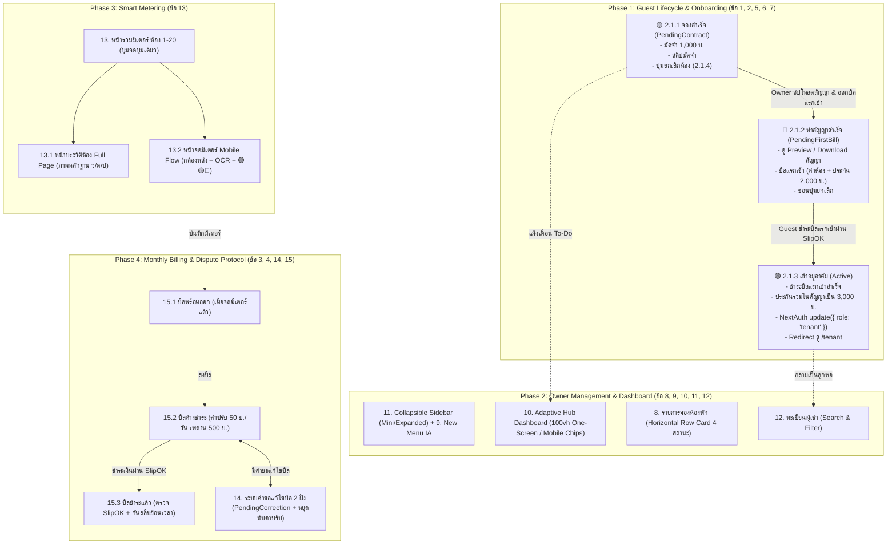

# 📋 แผนแม่บทการปรับปรุงระบบหอพักเกษร 2 (Comprehensive System Upgrade Plan)

> **เป้าหมาย:** ยกระดับระบบบริหารจัดการหอพักเกษร 2 สู่ความสมบูรณ์แบบตามข้อกำหนดทั้ง 15 ข้อ ครอบคลุมทั้ง **Frontend, Backend API, Database Migration, Security & Financial Integrity** โดยปราศจากข้อผิดพลาด (Zero-Bug & High Reliability)

---

## 🏗️ 1. สถาปัตยกรรมและภาพรวมการทำงานของระบบ (System Architecture & Pipeline)



---

## 💾 2. การปรับปรุงโครงสร้างฐานข้อมูล (Database Migrations)

เพื่อรองรับการคำนวณราคาใหม่ และระบบโต้แย้งบิลอย่างปลอดภัย จะต้องรัน Migration สคริปต์เพื่อปรับแก้ตารางดังนี้:

### 2.1 ตาราง `dormitory_profile` และ `dormitories`
```sql
-- เพิ่มคอลัมน์ค่าส่วนกลาง และปรับอัตราค่าน้ำ-ไฟ
ALTER TABLE dormitory_profile 
  ADD COLUMN IF NOT EXISTS common_fee DECIMAL(10,2) DEFAULT 150.00,
  MODIFY COLUMN electricity_rate DECIMAL(10,2) DEFAULT 4.88,
  MODIFY COLUMN water_rate DECIMAL(10,2) DEFAULT 100.00;

ALTER TABLE dormitories 
  ADD COLUMN IF NOT EXISTS common_fee DECIMAL(10,2) DEFAULT 150.00,
  MODIFY COLUMN electricity_rate DECIMAL(10,2) DEFAULT 4.88,
  MODIFY COLUMN water_rate DECIMAL(10,2) DEFAULT 100.00;

-- อัปเดตค่าเริ่มต้นสำหรับ หอพักเกษร 2 (id = 1)
UPDATE dormitory_profile 
SET electricity_rate = 4.88, water_rate = 100.00, common_fee = 150.00 
WHERE id = 1 OR dorm_id = 1;

UPDATE dormitories 
SET electricity_rate = 4.88, water_rate = 100.00, common_fee = 150.00 
WHERE id = 1;
```

### 2.2 ตาราง `contracts`
```sql
-- ปรับปรุงสถานะสัญญาให้รองรับ Flow การจองใหม่
ALTER TABLE contracts 
  MODIFY COLUMN status ENUM('PendingContract', 'PendingFirstBill', 'Active', 'Cancelled', 'Terminated', 'Expired', 'PendingOwnerSignature') DEFAULT 'PendingContract';
```

### 2.3 ตาราง `invoices`
```sql
-- เพิ่มคอลัมน์ค่าส่วนกลาง ค่าปรับ และสถานะการขอแก้ไขบิล
ALTER TABLE invoices
  ADD COLUMN IF NOT EXISTS common_fee DECIMAL(10,2) DEFAULT 150.00,
  ADD COLUMN IF NOT EXISTS penalty_amount DECIMAL(10,2) DEFAULT 0.00,
  ADD COLUMN IF NOT EXISTS days_overdue INT DEFAULT 0,
  ADD COLUMN IF NOT EXISTS is_first_bill TINYINT(1) DEFAULT 0,
  MODIFY COLUMN status ENUM('Pending', 'Paid', 'Overdue', 'Cancelled', 'PendingCorrection') DEFAULT 'Pending';
```

### 2.4 สร้างตารางใหม่ `bill_corrections` (สำหรับข้อ 14 - ระบบขอแก้ไขบิล)
```sql
CREATE TABLE IF NOT EXISTS bill_corrections (
  id INT AUTO_INCREMENT PRIMARY KEY,
  invoice_id INT NOT NULL,
  requested_by ENUM('owner', 'tenant') NOT NULL,
  requester_id INT NOT NULL,
  old_electric_reading DECIMAL(10,2) NOT NULL,
  new_electric_reading DECIMAL(10,2) NOT NULL,
  old_total_amount DECIMAL(10,2) NOT NULL,
  new_total_amount DECIMAL(10,2) NOT NULL,
  evidence_photo_url TEXT,
  reason TEXT,
  status ENUM('Pending', 'Approved', 'Rejected') DEFAULT 'Pending',
  reviewed_at DATETIME NULL,
  created_at TIMESTAMP DEFAULT CURRENT_TIMESTAMP,
  FOREIGN KEY (invoice_id) REFERENCES invoices(id) ON DELETE CASCADE
);
```

---

## 🛠️ 3. แผนการพัฒนารายหมวดหมู่ (Step-by-Step Implementation Roadmap)

---

### 🟢 หมวดที่ 1: ระบบ Guest Lifecycle & Dashboard (ข้อ 1, 2, 5, 6, 7)

1. **[Navbar] [app/components/Navbar.tsx](file:///d:/Works/thesiss/kesorn/app/components/Navbar.tsx):**
   - ลบปุ่ม `📋 สถานะการจอง` ออกจาก Navbar หลักสำหรับทุก Role
2. **[Guest Dashboard] [app/guest/page.tsx](file:///d:/Works/thesiss/kesorn/app/guest/page.tsx):**
   - สร้าง Dashboard หรูหราสำหรับ Guest แสดง Room Details Card, แถบสถานะ 3 ขั้นตอน:
     - **2.1.1 `PendingContract`:** มัดจำ 1,000 บาท มีปุ่ม `[ ❌ ยกเลิกการจอง ]`
     - **2.1.2 `PendingFirstBill`:** การ์ดสัญญาเช่าเพื่อรอการเข้าอยู่ (ปุ่ม Preview/Download สัญญา) + บิลค่าแรกเข้า (`ค่าห้อง + ประกันเพิ่ม 2,000 บาท`) **ซ่อนปุ่มยกเลิก**
     - **2.1.3 `Active`:** เมื่อจ่ายบิลแรกเข้าสำเร็จ:
       - อัปเดต `deposit_amount = 3000.00`
       - เปลี่ยน Role ใน DB เป็น `tenant`
       - Client-side รัน `await update({ role: 'tenant' })`
       - `router.push('/tenant')` และข้อมูลสัญญาจะปรากฏที่ [app/tenant/contract/page.tsx](file:///d:/Works/thesiss/kesorn/app/tenant/contract/page.tsx)
3. **[API Booking Status & Cancel] ([app/api/booking/status/route.ts](file:///d:/Works/thesiss/kesorn/app/api/booking/status/route.ts), [app/api/booking/cancel/route.ts](file:///d:/Works/thesiss/kesorn/app/api/booking/cancel/route.ts)):**
   - รองรับ `PendingContract`, `PendingFirstBill`, `Active`, `Cancelled`
   - การกดยกเลิกใน 2.1.4 จะคืนสถานะห้องเป็น `Available` ทันทีและไม่คืนมัดจำ
4. **[Owner First Bill Generation] ([app/owner/contracts/page.tsx](file:///d:/Works/thesiss/kesorn/app/owner/contracts/page.tsx)):**
   - เมื่อ Owner อัปโหลดสัญญาเสร็จ ระบบจะสร้างบิลแรกเข้าอัตโนมัติ (`is_first_bill = 1`) ยอดเงิน `ค่าห้อง + 2,000`
5. **[ลบ Owner Onboarding] ([app/owner/page.tsx](file:///d:/Works/thesiss/kesorn/app/owner/page.tsx)):**
   - ตัดโค้ด Redirect ไป `/owner/onboarding` ออก ให้ Owner เข้าสู่ Dashboard หลักได้ทันที

---

### 🔵 หมวดที่ 2: โครงสร้างเมนู & แดชบอร์ดภาพรวมของ Owner (ข้อ 8, 9, 10, 11, 12)

1. **[New IA Sidebar & Collapsible Mini Mode] ([app/owner/components/OwnerSidebar.tsx](file:///d:/Works/thesiss/kesorn/app/owner/components/OwnerSidebar.tsx)):**
   - **พับเก็บเป็น Icon-only (~68px) พร้อม Tooltip เมื่อ Hover**
   - จำค่าเปิด/ปิดใน `localStorage`
   - จัดหมวดหมู่ใหม่ 3 กลุ่ม:
     - 📊 **ภาพรวม (Dashboard)**
     - 📁 **1. การจัดการ:** 🔔 รายการจองห้องพัก | 🚪 ผังห้องพัก | 👥 ทะเบียนผู้เช่า
     - 💳 **2. การเงินและสัญญา:** 📝 สัญญาเช่า | ⚡ จดมิเตอร์น้ำ-ไฟ | 💰 บิลค่าเช่ารายเดือน | 📈 บัญชีรายรับ-จ่าย
     - ⚙️ **3. บริการและระบบ:** 💬 แชทลูกหอ | 🔧 แจ้งซ่อม/แม่บ้าน | ⚖️ กฎระเบียบหอ | 🧹 ทีมผู้ดูแล | ⚙️ ตั้งค่าหอพัก
2. **[Adaptive Hub Dashboard] ([app/owner/page.tsx](file:///d:/Works/thesiss/kesorn/app/owner/page.tsx)):**
   - **Desktop (100vh One-Screen No Scroll):**
     - *ซ้าย (25%):* KPI ห้องพัก (20 ห้อง, ว่าง/อยู่/จอง), ยอดเงินประจำเดือน, งานด่วน To-Do
     - *กลาง (50%):* Tab แคปซูล `[จองใหม่]` `[สลิปรอตรวจ]` `[งานซ่อม]` พร้อม Row Cards และ Internal Scroll
     - *ขวา (25%):* Quick Actions (จดมิเตอร์, ออกบิล) + Real-time Activity Timeline 5 รายการ
   - **Mobile:** Sticky Summary Bar + Segmented Chips + Task Cards ขนาดพอดีมือ
3. **[หน้ารายการจองห้องพัก] ([app/owner/bookings/page.tsx](file:///d:/Works/thesiss/kesorn/app/owner/bookings/page.tsx)):**
   - ดีไซน์ **Horizontal Row Card** 4 แท็บฟิลเตอร์:
     - 🟡 8.1 ชำระมัดจำแล้ว รอทำสัญญา (`PendingContract`)
     - 🔵 8.2 ทำสัญญาแล้ว รอชำระค่าแรกเข้า (`PendingFirstBill`)
     - 🟢 8.3 เสร็จสิ้นกระบวนการจอง (`Active`)
     - 🔴 8.4 ยกเลิกการจอง (`Cancelled`)
4. **[ทะเบียนผู้เช่า] ([app/owner/tenants/page.tsx](file:///d:/Works/thesiss/kesorn/app/owner/tenants/page.tsx)):**
   - เพิ่ม Search Bar (ค้นหาเลขห้อง, ชื่อ, เบอร์โทร) และ Dropdown Filter (ชั้น, สถานะสัญญา)

---

### 🟡 หมวดที่ 3: ระบบจดมิเตอร์อัจฉริยะ 20 ห้อง (ข้อ 13, 13.1, 13.2)

1. **[หน้ารวมมิเตอร์ 20 ห้อง] ([app/owner/meters/page.tsx](file:///d:/Works/thesiss/kesorn/app/owner/meters/page.tsx)):**
   - แสดงครบห้อง 1 ถึง ห้อง 20 แม้ไม่มีคนอยู่
   - คอลัมน์: `ห้อง` | `รอบบิลล่าสุด` | `เลขมิเตอร์ล่าสุด` | `ปุ่มรายละเอียด (Full-page)`
   - ปุ่มหลักปุ่มเดียว: **`[ 📸 จดมิเตอร์รอบใหม่ ]`**
   - *เงื่อนไข:* ห้องที่ไม่ได้ถ่ายมิเตอร์ จะไม่ถูกนำไปออกบิล
2. **[หน้าประวัติรายห้อง Full-Page] (`/app/owner/meters/[roomId]/page.tsx`):**
   - ตารางประวัติ: `รอบบิล (ว/ด/ป)` | `เลขก่อน` | `เลขหลัง` | `หน่วยที่ใช้` | `รูปถ่ายหลักฐานมิเตอร์` (เปิดดูภาพใหญ่ได้)
3. **[หน้าจดมิเตอร์ Mobile Flow] (`/app/owner/meters/record/page.tsx`):**
   - เริ่มจดทีละห้อง 1 ➔ 20
   - Dropdown สลับห้อง (ห้องที่บันทึกแล้วขึ้นแถบสีเขียว ✅)
   - เปิด **กล้องหลังอัตโนมัติ** + ปุ่มเลือกรูปจากคลังภาพ
   - Client-side Image Compression บีบอัดเป็น WebP (200-400KB)
   - **ระบบ Smart Alert สี Interactive:**
     - 🟢 **สีเขียว:** `เลขใหม่ > เลขเดิม` และ `หน่วย <= 200` ➔ ปุ่มบันทึกสีเขียว
     - 🟡 **สีเหลือง:** `เลขใหม่ > เลขเดิม` แต่ `หน่วย > 200` ➔ ปุ่มสีเหลือง + Modal ยืนยัน
     - 🔴 **สีแดง:** `เลขใหม่ < เลขเดิม` ➔ แจ้งเตือนสีแดง + **Disable ปุ่มบันทึก**
   - ปุ่มข้ามสีเทา `[ ⏭️ ข้ามห้องนี้ ]`
   - **ห้องสุดท้าย (13.2.6):** เปลี่ยนปุ่มเป็น `[ 🎉 เสร็จสิ้นการจดมิเตอร์ ]` พร้อม Toast สรุปผลและ Redirect กลับหน้ารวม

---

### 🔴 หมวดที่ 4: ระบบบิลรายเดือน & ข้อพิพาทมิเตอร์ (ข้อ 3, 4, 14, 15)

1. **[ระบบคำขอแก้ไขบิลมิเตอร์ 2 ฝั่ง] (ข้อ 14):**
   - ทั้ง Owner และ Tenant สามารถส่งคำขอแก้ไขได้หากพบว่า AI/ระบบอ่านเลขผิด
   - เมื่อส่งคำขอ ➔ บิลติดแท็ก `PendingCorrection` (ระงับการจ่ายเงิน)
   - **คำนวณค่าปรับกรณีมีข้อพิพาท (14.3.3):**
     - ขณะรออนุมัติ ตัวนับค่าปรับจะถูกหยุดไว้ชั่วคราว
     - หากได้รับอนุมัติ ➔ Recalculate ยอดบิลใหม่ + ให้เวลา 5 วันนับจากวันที่ออกบิลใหม่ก่อนเริ่มคิดค่าปรับ
     - หากคำขอถูกปฏิเสธ ➔ กลับมาคิดค่าปรับตามรอบเดิม
   - **เมื่อบิลชำระแล้ว (`Paid`) จะปิดระบบล็อกห้ามขอแก้ไขย้อนหลัง**
2. **[หน้าระบบบิลค่าเช่ารายเดือน] ([app/owner/billing/page.tsx](file:///d:/Works/thesiss/kesorn/app/owner/billing/page.tsx)):**
   - การ์ด 3 แท็บ: **บิลพร้อมออก** | **บิลค้างชำระ** | **บิลชำระแล้ว**
   - **15.1 บิลพร้อมออก:** แสดงห้องที่จดมิเตอร์แล้ว พร้อมปุ่ม `[ 🚀 ส่งบิลทั้งหมด ]`
   - **15.2 บิลค้างชำระ (สูตรค่าปรับวันละ 50 บาท เพดาน 500 บาท):**
     - วันครบกำหนด (`due_date`): ออกก่อนสิ้นเดือนนับถึงวันที่ 5 / ออกภายในเดือนนับ 5 วันจากวันออกบิล
     - ค่าปรับ: $\min(500, \text{daysOverdue} \times 50)$ แสดงแยกบรรทัดค่าปรับ แต่รวมใน **1 QR Code**
   - **15.3 บิลชำระแล้ว (SlipOK Security Engine):**
     - คำนวณความถูกต้องย้อนหลังจาก `transDateTime` ในสลิป
     - ตรวจสอบ `slip_trans_datetime >= invoice_created_at` (หากสลิปออกก่อนวันออกบิล ➔ Reject ทันที)
     - แสดงรายละเอียดผู้โอน, ธนาคาร, ยอดเงิน, วัน-เวลาโอนจริงบนการ์ด

---

## 🔒 4. มาตรการความปลอดภัยและความถูกต้องทางการเงิน (Financial & Data Integrity Check)

| จุดตรวจสอบ | ความเสี่ยงที่อาจเกิดขึ้น | มาตรการป้องกันในแผนงาน |
| :--- | :--- | :--- |
| **การเปลี่ยนสิทธิ์ Session** | JWT Token ยังค้างสถานะ Guest | Client เรียก `update({ role: 'tenant' })` ทันทีหลัง SlipOK ผ่าน |
| **การแก้ไขมิเตอร์ย้อนหลัง** | กระทบเลขมิเตอร์เดือนถัดไป | Cascade update `previous_reading` ของรอบถัดไปแบบอัตโนมัติ |
| **การโอนเงินหนีค่าปรับ** | จ่ายเงินช้าแต่แนบสลิปยอดเดิม | คำนวณยอดเงินที่ต้องจ่ายยึดตาม `transDateTime` จริงในสลิป |
| **สลิปย้อนเวลา / สลิปวน** | นำสลิปเก่ามาใช้ซ้ำ | ตรวจสอบ `transRef` ซ้ำ และตรวจเงื่อนไขเวลา `slip_time >= bill_time` |
| **รูปถ่ายมิเตอร์ขนาดใหญ่** | เปลืองพื้นที่เซิร์ฟเวอร์ | Client-side WebP Compression ควบคุมขนาดรูปไม่เกิน 400KB |

---

## 🏁 5. ลำดับขั้นตอนการดำเนินการ (Execution Order)

1. **Step 1:** รัน Database Migration (`dormitory_profile`, `invoices`, `contracts`, `bill_corrections`)
2. **Step 2:** ปรับ Navbar, สร้าง Guest Dashboard, และปรับ Booking API (ข้อ 1, 2, 5, 6, 7)
3. **Step 3:** ปรับ Sidebar New IA + Collapsible Mini Mode + Dashboard Adaptive Hub + รายการจอง Horizontal Row Card + ทะเบียนผู้เช่า (ข้อ 8, 9, 10, 11, 12)
4. **Step 4:** สร้างระบบจดมิเตอร์ 20 ห้อง + ประวัติ Full Page + หน้าจดมือถือกล้องหลัง OCR (ข้อ 13)
5. **Step 5:** ปรับระบบบิลรายเดือน 3 แท็บ + สูตรค่าปรับ 50 บ./วัน (เพดาน 500) + ระบบขอแก้ไขบิล 2 ฝั่ง + SlipOK Security Check (ข้อ 3, 4, 14, 15)
6. **Step 6:** ทดสอบ End-to-End Test (E2E) ทุก Flow อย่างสมบูรณ์แบบ
